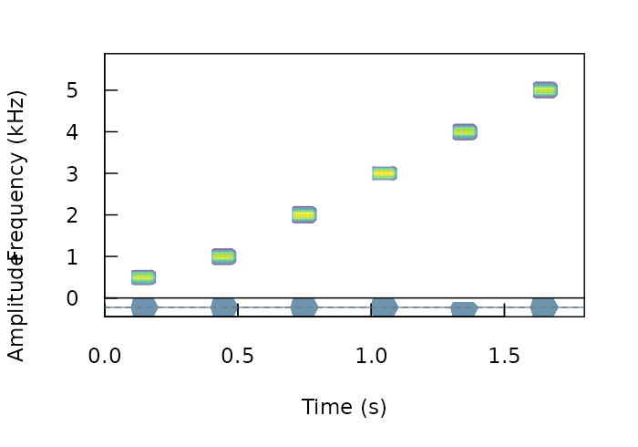
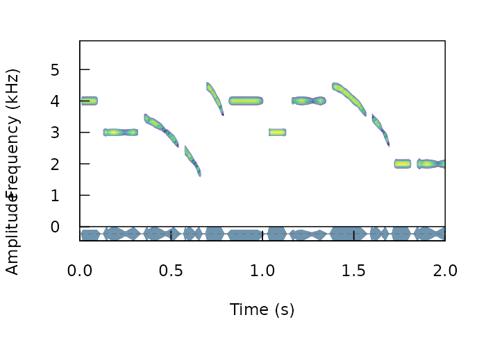
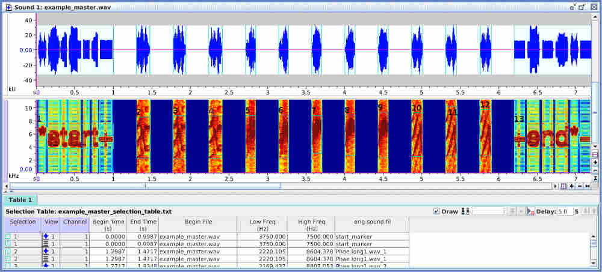
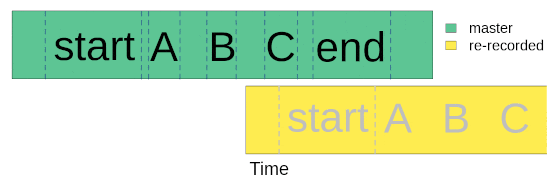
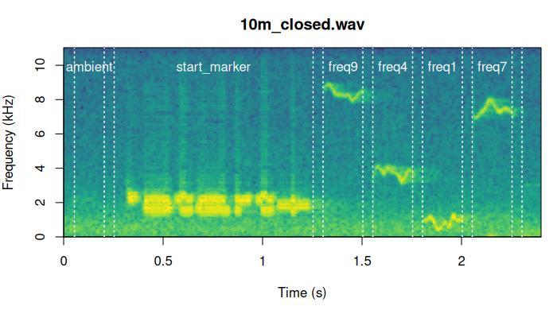
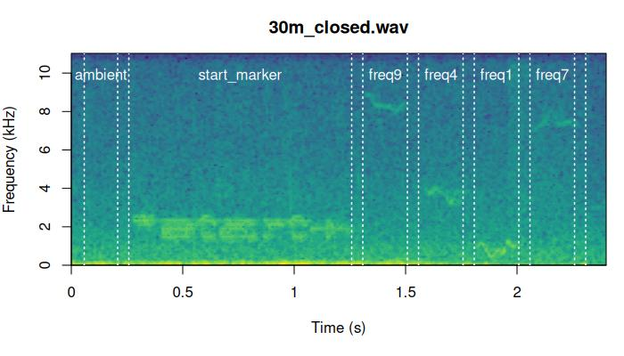
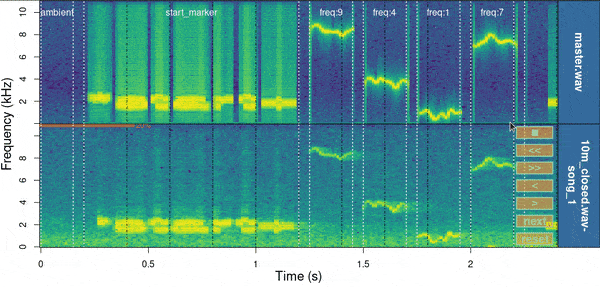
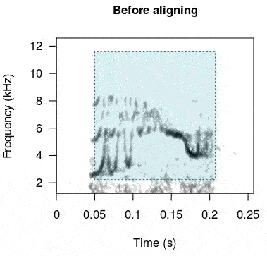

# Synthesize and align test sounds

 


This vignette deals with two things: how to create synthetic sounds for
playback experiments and how to align re-recorded sounds to their
reference once playback has been conducted. Here is some terms that will
be used in this vignettes and throughout the package.

## Glossary

\-**Model sound**: sound in which propagation properties will be
studied, usually found in the original field recordings or synthetic
sound files.

\-**Reference sound**: sound to use as a pattern to compare against.
Usually created by re-recording a model sound broadcast at 1 m from the
source (speaker).

\-**Sound ID**: ID of sounds used to identify counterparts across
distances. Each sound must have a unique ID within a distance.

\-**Ambient noise**: energy from background sounds in the recording,
excluding sounds of interest.

\-**Test sound**: sounds re-recorded far from the source to test for
propagation/degradation (also refer to as ‘re-recorded’ sounds).

\-**Degradation**: loose term used to describe any changes in the
structure of a sound when transmitted in a habitat.

 

Note the use of the syntax `package_name::function()` in the code
throughout the vignette to explicitly identify the packages each
function belongs to.

------------------------------------------------------------------------

## Synthesize sounds

We often want to figure out how propagation properties vary across a
range of frequencies. For instance, Tobias et al (2010) studied whether
acoustic adaptation (a special case of sensory drive; Morton 1975),
could explain song evolution in Amazonian avian communities. To test
this the authors created synthetic pure tone sounds that were used as
playback and re-recorded in different habitats. This is the actual
procedure of creating synthetic sounds as they described it:

> “Tones were synthesized at six different frequencies (0.5, 1.0, 2.0,
> 3.0, 4.0, and 5.0 kHz) to encompass the range of maximum avian
> auditory sensitivity (Dooling 1982). At each frequency, we generated
> two sequences of two 100-msec tones. One sequence had a relatively
> short interval of 150 msec, close to the mean internote interval in
> our sample (152± 4 msec). The other sequence had a longer interval of
> 250 msec, close to the mean maximum internote interval in our sample
> (283± 74 msec). The first sequence reflects a fast-paced song and the
> second a slower paced song (sensu Slabbekoorn et al. 2007). The master
> file (44100 Hz/16 bit WAV) thereby consisted of a series of 12 pairs
> of artificial 100-ms constant-frequency tones at six different
> frequencies (0.5, 1.0, 2.0, 3.0, 4.0, and 5.0 kHz).”

We can synthesize the same pure tones using the function
[`synth_sounds()`](https://docs.ropensci.org/baRulho/reference/synth_sounds.md).
The function requires 1) the frequencies of tones to synthesize
(argument `frequencies`, in kHz) and 2) the duration of the tones
(`durations`, in seconds). In addition, logical arguments `fm` and `am`
allow to create frequency and amplitude modulated sounds respectively.
In our case we need six tones of 100 ms at 0.5, 1, 2, 3, 4, and 5 kHz
separated by intervals of 150 ms (at least for the first synthetic file
described in Tobias et al 2010). We can also get a selection table
(sensu [warbleR](https://cran.r-project.org/package=warbleR)) with the
information about the time and frequency location of every sound. This
would be required in order to make the master sound file. To get the
selection table we need to set the argument `selec.table = TRUE`. This
can be done as follows:

``` r

# load packages
library(viridis)
```

    Loading required package: viridisLite

``` r

library(baRulho)
```

    Loading required package: warbleR

    Loading required package: tuneR

    Loading required package: seewave

    Loading required package: NatureSounds

    Loading required package: ohun

    Warning: package 'ohun' was built under R version 4.6.1


    Please cite 'ohun' as: 

     Araya-Salas, M., Smith-Vidaurre, G., Chaverri, G., Brenes, J. C., Chirino, F., Elizondo-Calvo, J., & Rico-Guevara, A. 2023. ohun: an R package for diagnosing and optimizing automatic sound event detection. Methods in Ecology and Evolution. https://doi.org/10.1111/2041-210X.14170


    Please cite 'baRulho' as: 

    Araya-Salas, M., Grabarczyk, E. E., Quiroz-Oliva, M., Garcia-Rodriguez, A., & Rico-Guevara, A. (2025). Quantifying degradation in animal acoustic signals with the R package baRulho. Methods in Ecology and Evolution, 00, 1-12. https://doi.org/10.1111/2041-210X.14481


    Attaching package: 'baRulho'

    The following object is masked from 'package:seewave':

        attenuation

``` r

library(Rraven)

# synthesize
synth_est <- baRulho::synth_sounds(
  mar = 0.1,
  frequencies = c(0.5, 1:5),
  durations = 0.1,
  fm = FALSE,
  am = FALSE,
  sampling.rate = 12
)
```

    
[30msynthesizing sounds (step 0 of 0):
[39m

``` r

# convert into a single wave object
synth_wav <- Rraven::exp_est(X = synth_est,
                             single.file = TRUE,
                             wave.object = TRUE)


# plot spectro
seewave::spectro(
  wave = synth_wav,
  scale = FALSE,
  palette = viridis,
  grid = FALSE,
  collevels = seq(-20, 0, 1),
  osc = TRUE,
  colwave = "#31688EB3",
  heights = c(2, 1),
  wl = 100
)
```



 

The function can add variation to additional acoustic dimensions. For
instance the following code generates all possible combinations of
frequencies (2, 3 and 4 kHz), durations (0.1, and 0.2 s), frequency
modulation (tonal and modulated) and amplitude modulation (flat and
modulated envelope):

``` r

# synthesize
synth_est2 <- baRulho::synth_sounds(
  mar = 0.01,
  sig2 = 0.05,
  frequencies = 2:4,
  durations = c(0.1, 0.2),
  fm = TRUE,
  am = TRUE,
  shuffle = TRUE,
  seed = 123,
  sampling.rate = 12, 
  freq.range = 1
)

# convert into a single wave object
synth_wav2 <- Rraven::exp_est(
  X = synth_est2,
  single.file = TRUE,
  path = tempdir(),
  wave.object = TRUE
)

# plot spectro
seewave::spectro(
  synth_wav2,
  tlim = c(0, 2),
  scale = FALSE,
  palette = viridis,
  grid = FALSE,
  collevels = seq(-20, 0, 1),
  osc = TRUE,
  colwave = "#31688EB3",
  heights = c(2, 1),
  wl = 140
)
```



Note that the output is an extended selection table (take a look at this
[annotation format
vignette](https://marce10.github.io/warbleR/articles/annotation_data_format.html)
from [warbleR](https://marce10.github.io/warbleR/) for more details on
this object format). It contains the time-frequency annotations for all
synthetic sounds:

``` r

# check first 6 rows
head(as.data.frame(synth_est2))
```

| sound.files | selec | start | end | bottom.freq | top.freq | frequency | duration | frequency.modulation | amplitude.modulation | treatment | replicate | sound.id |
|:--:|:--:|:--:|:--:|:--:|:--:|:--:|:--:|:--:|:--:|:--:|:--:|:--:|
| synthetic_sound_1 | 1 | 0.01 | 0.11 | 3.8 | 4.2 | 4 | 0.1 | tonal | flat | dur:0.1;freq:4;tonal;flat | 1 | dur:0.1;freq:4;tonal;flat_1 |
| synthetic_sound_2 | 1 | 0.01 | 0.21 | 2.8 | 3.2 | 3 | 0.2 | tonal | am | dur:0.2;freq:3;tonal;am | 1 | dur:0.2;freq:3;tonal;am_1 |
| synthetic_sound_3 | 1 | 0.01 | 0.21 | 2.5 | 3.5 | 3 | 0.2 | fm | am | dur:0.2;freq:3;fm;am | 1 | dur:0.2;freq:3;fm;am_1 |
| synthetic_sound_4 | 1 | 0.01 | 0.11 | 1.5 | 2.5 | 2 | 0.1 | fm | am | dur:0.1;freq:2;fm;am | 1 | dur:0.1;freq:2;fm;am_1 |
| synthetic_sound_5 | 1 | 0.01 | 0.11 | 3.5 | 4.5 | 4 | 0.1 | fm | flat | dur:0.1;freq:4;fm;flat | 1 | dur:0.1;freq:4;fm;flat_1 |
| synthetic_sound_6 | 1 | 0.01 | 0.21 | 3.8 | 4.2 | 4 | 0.2 | tonal | flat | dur:0.2;freq:4;tonal;flat | 1 | dur:0.2;freq:4;tonal;flat_1 |

 

As this is an extended selection table, the ‘sound.files’ column refers
to Wave objects included as attributes instead of files in a directory:

``` r

# check name of wave objects
names(attributes(synth_est2)$wave.objects)
```

     [1] "synthetic_sound_1"  "synthetic_sound_2"  "synthetic_sound_3"  "synthetic_sound_4" 
     [5] "synthetic_sound_5"  "synthetic_sound_6"  "synthetic_sound_7"  "synthetic_sound_8" 
     [9] "synthetic_sound_9"  "synthetic_sound_10" "synthetic_sound_11" "synthetic_sound_12"
    [13] "synthetic_sound_13" "synthetic_sound_14" "synthetic_sound_15" "synthetic_sound_16"
    [17] "synthetic_sound_17" "synthetic_sound_18" "synthetic_sound_19" "synthetic_sound_20"
    [21] "synthetic_sound_21" "synthetic_sound_22" "synthetic_sound_23" "synthetic_sound_24"

 

## Create master sound file for playback

The function
[`master_sound_file()`](https://docs.ropensci.org/baRulho/reference/master_sound_file.md)
creates a master sound file (as you probably guessed) for playback
experiments. The function takes wave objects from an data frame or
(extended) selection table containing the model sounds and concatenates
them in a single sound file (with some silence in between sounds which
length can be modified).
[`master_sound_file()`](https://docs.ropensci.org/baRulho/reference/master_sound_file.md)
adds acoustic markers at the start and end of the playback that can be
used to time-sync re-recorded sounds, which streamlines quantification
of acoustic degradation. The following example shows how to create a
master sound file using the synthetic sounds generated above. For the
synthetic sounds we need to add a little space between the top and
bottom frequency because `sim_songs()` make those values exactly the
same for pure tones:

``` r

# create master sound file
synth_master_annotations <- baRulho::master_sound_file(
  X = synth_est,
  file.name = "synthetic_master",
  dest.path = tempdir(),
  gap.duration = 0.15
)
```

    
[30mThe file synthetic_master.wav has been saved in the directory path '/tmp/RtmpXypp25'
[39m

 

The function saves the master sound file as a wave file and returns a
selection table in the R environment with the time and frequency
‘coordinates’ of the sounds in that file (be careful when playing the
master sound file as it can be shocking for some audiences!). We can
look at the spectrogram of the output file using the
[seewave](https://cran.r-project.org/package=seewave) function
`spectro()` as follows:

``` r

# read wave file
wave <-
  tuneR::readWave(file.path(tempdir(), "synthetic_master.wav"))

# plot spectrogram
seewave::spectro(
  wave,
  scale = FALSE,
  palette = viridis,
  wl = 150,
  grid = FALSE,
  flim = c(0, 4.7)
)
```


The function can also create a master sound file from sounds found in
sound files and from several sounds files, as is likely the case with
recordings collected in the field. The following example shows how to
create a master sound file using several sound files. The code uses the
example data and recordings from the package
[warbleR](https://cran.r-project.org/package=warbleR):

``` r

# load example data from warbleR
data(list = c(
  "Phae.long1",
  "Phae.long2",
  "Phae.long3",
  "Phae.long4",
  "lbh_selec_table"
))

# save sound files to temporary folder
tuneR::writeWave(Phae.long1, file.path(tempdir(), "Phae.long1.wav"))
tuneR::writeWave(Phae.long2, file.path(tempdir(), "Phae.long2.wav"))
tuneR::writeWave(Phae.long3, file.path(tempdir(), "Phae.long3.wav"))
tuneR::writeWave(Phae.long4, file.path(tempdir(), "Phae.long4.wav"))

# make an extended selection table
est <- warbleR::selection_table(
  X = lbh_selec_table,
  extended = TRUE,
  path = tempdir(),
  pb = FALSE
)
```

    
[30mall selections are OK 
    
[39m

``` r

# add sound_id column
est$sound.id <- paste0(abbreviate(est$sound.files), est$selec)

# create master sound file
master_annotations <- baRulho::master_sound_file(
  X = est,
  file.name = "example_master",
  dest.path = tempdir(),
  gap.duration = 0.3
)
```

    
[30mThe file example_master.wav has been saved in the directory path '/tmp/RtmpXypp25'
[39m

 

Again, we can look at the spectrogram of the output file:

``` r

# read wave file
wave <-
  tuneR::readWave(file.path(tempdir(), "example_master.wav"))

# plot spectrogram
seewave::spectro(
  wave,
  scale = FALSE,
  palette = viridis,
  collevels = seq(-120, 0, 5),
  wl = 500,
  grid = FALSE,
  flim = c(0, 10)
)
```


Note that the output could also be exported to [Raven sound analysis
software](https://www.ravensoundsoftware.com/software/raven-pro/)
([Cornell Lab of Ornithology](https://www.birds.cornell.edu/home)) for
visualization or further manipulation using the function
[`exp_raven()`](https://rdrr.io/pkg/Rraven/man/exp_raven.html) from the
[Rraven](https://cran.r-project.org/package=Rraven) package.
[`exp_raven()`](https://rdrr.io/pkg/Rraven/man/exp_raven.html) exports
selections in the R environment to a ‘.txt’ file that can be read in
Raven:

``` r

Rraven::exp_raven(master_annotations, path = tempdir(),
                  file.name = "example_master_selection_table")
```

 

Both sound files and annotations can be visualized in Raven ( acoustic
analysis software):



 

Take a look at the [Rraven
vignette](https://CRAN.R-project.org/package=Rraven/vignettes/Rraven.html)
for more details on how to export and import data from R to Raven.

Note that the start and end markers are placed at relatively low
frequencies so they are less affected by degradation. The frequency
range of markers can be set with argument `flim`. The relative amplitude
of markers can also be adjusted with the `amp.marker` argument.
Amplitude of markers will be multiplied by the value supplied so markers
will be louder than sounds. These two features should increases the
chances of detecting the markers at further distances.

## Align re-recorded sounds

Once we went to the field (or lab) and re-recorded the master sound
files at different distances, we are ready to start with data analysis.
The first step for getting the data ready for analysis involves finding
sounds within the re-recorded sound files. We only need to align the
start marker between the master playback and the re-recorded sound
files, based on the fact that the time difference between the marker and
the sounds should be the same in both cases:



 

We will use acoustic data included in the package as example data. This
is a data subset from a sound propagation experiment. The complete data
set of the experiment is hosted in [this
repository](https://figshare.com/articles/media/baRulho_an_R_package_to_quantify_animal_acoustic_signal_transmission_and_degradation/21559074).
There are two example objects that will be used:

``` r

data("master_est")

data("test_sounds_est")
```

 

These are the files contained in the data set:

``` r

unique(master_est$sound.files)
```

    [1] "master.wav"

``` r

unique(test_sounds_est$sound.files)
```

    [1] "10m_closed.wav" "30m_closed.wav" "10m_open.wav"   "1m_open.wav"    "30m_open.wav"  

 

Their names are self-explanatory: a master sound file (“master.wav”) and
its annotations, a reference sound file (“reference_1m.wav”) and two
test files (“test_10m.wav” and “test_20m.wav”) re-recorded at 10 and 20
m respectively.

Now we will save those files in a temporary working directory (those
objects are extended selection tables in the R environment) to resemble
the usual case in which the acoustic data is found in sound files.

``` r

# first remove any other wave file in the temporary working directory (dont do it with your data!)
unlink(list.files(
  path = tempdir(),
  full.names = TRUE,
  pattern = ".wav"
))

# save master sound file
tuneR::writeWave(object = attr(master_est, "wave.objects")[[1]],
          file.path(tempdir(), "master.wav"))

# save test sound files
for (i in unique(test_sounds_est$sound.files)) {
  tuneR::writeWave(object = attr(test_sounds_est, "wave.objects")[[i]], file.path(tempdir(), i))
}

# make annotations a data frame
master_annotations <- as.data.frame(master_est)
```

 

The annotations needed for aligning test sound must share the following
structure:

``` r

master_annotations
```

| sound.files | selec |  start   |   end    | bottom.freq | top.freq |   sound.id   |
|:-----------:|:-----:|:--------:|:--------:|:-----------:|:--------:|:------------:|
| master.wav  |   1   | 0.050000 | 0.200000 |  1.333333   | 2.666667 |   ambient    |
| master.wav  |   2   | 0.250000 | 1.250000 |  1.333333   | 2.666667 | start_marker |
| master.wav  |   3   | 1.300000 | 1.500023 |  7.875000   | 8.805000 |    freq9     |
| master.wav  |   4   | 1.550023 | 1.750045 |  3.208000   | 4.069000 |    freq4     |
| master.wav  |   5   | 1.800045 | 2.000068 |  0.422000   | 1.223000 |    freq1     |
| master.wav  |   6   | 2.050068 | 2.250091 |  6.905000   | 7.917000 |    freq7     |

 

Note the ‘sound.id’ column which contains a unique identifier for each
sound. This will be used to label their counterparts in the test sound
files. Users can import annotations from
[Raven](https://www.ravensoundsoftware.com/software/raven-pro/) using
the [Rraven](https://cran.r-project.org/package=Rraven) package ([see
this
vignette](https://CRAN.R-project.org/package=Rraven/vignettes/Rraven.html)).

To find the location of the start marker on the test sound files we use
the functions
[`find_markers()`](https://docs.ropensci.org/baRulho/reference/find_markers.md)
to run a cross-correlation of one or more markers across the test files
in order to determine the exact time in which each marker is found:

``` r

markers_position <-
  baRulho::find_markers(X = master_annotations, path = tempdir())

markers_position
```

|  sound.files   | selec |   start   |   end    |  scores   |    marker    | time.mismatch |
|:--------------:|:-----:|:---------:|:--------:|:---------:|:------------:|:-------------:|
| 10m_closed.wav |   1   | 0.2575707 | 1.257571 | 0.6363941 | start_marker |   0.010475    |
| 10m_closed.wav |   2   | 2.3181364 | 3.318136 | 0.8416042 |  end_marker  |      NA       |
|  10m_open.wav  |   3   | 0.2575707 | 1.257571 | 0.7394769 | start_marker |   0.010475    |
|  10m_open.wav  |   4   | 2.3181364 | 3.318136 | 0.8244886 |  end_marker  |      NA       |
|  1m_open.wav   |   5   | 0.2575707 | 1.257571 | 0.8043774 | start_marker |   0.010475    |
|  1m_open.wav   |   6   | 2.3181364 | 3.318136 | 0.8987528 |  end_marker  |      NA       |

 

The position of the markers is determined as the highest spectrogram
cross-correlation value for each marker using the functions
[`find_markers()`](https://docs.ropensci.org/baRulho/reference/find_markers.md).
If two or more markers are used the function computes an additional
column, ‘time.mismatch’, that compares the time difference between the
two markers in the test files against that in the master sound file. In
a perfect detection the value must be 0. So this number can be used as a
measure of error. In some cases precision can improve by increasing the
time resolution of the spectrogram, that is, by lowering the size of the
time window. This is done with the argument ‘hop.size’. By default it is
11.6 ms (which is equivalent to a 512 samples window length in a 44.1
kHz file). Let’s try 4 ms:

``` r

# lower window length
markers_position <-
  baRulho::find_markers(X = master_annotations,
                        hop.size = 4,
                        path = tempdir())

markers_position
```

|  sound.files   | selec |   start   |   end    |  scores   |    marker    | time.mismatch |
|:--------------:|:-----:|:---------:|:--------:|:---------:|:------------:|:-------------:|
| 10m_closed.wav |   1   | 0.2520095 | 1.252009 | 0.6135088 | start_marker |   0.0019868   |
| 10m_closed.wav |   2   | 2.3040871 | 3.304087 | 0.8675214 |  end_marker  |      NA       |
|  10m_open.wav  |   3   | 0.2520095 | 1.252009 | 0.8155176 | start_marker |   0.0019868   |
|  10m_open.wav  |   4   | 2.3040871 | 3.304087 | 0.8701115 |  end_marker  |      NA       |
|  1m_open.wav   |   5   | 0.2520095 | 1.252009 | 0.9124979 | start_marker |   0.0019868   |
|  1m_open.wav   |   6   | 2.3040871 | 3.304087 | 0.8941676 |  end_marker  |      NA       |

 

With the time location of acoustic markers we can infer the position of
all other sounds in the new recordings. A selection table from
re-recorded files can be generated using the function
[`align_test_files()`](https://docs.ropensci.org/baRulho/reference/align_test_files.md):

``` r

aligned_tests <-
  baRulho::align_test_files(
    X = master_annotations,
    Y = markers_position,
    by.song = TRUE,
    remove.markers = FALSE,
    path = tempdir()
  )
```

 

The function returns an object of the same class of the input object
‘X’. In this case ‘X’ is an `data.frame`:

``` r

is.data.frame(aligned_tests)
```

    [1] TRUE

``` r

aligned_tests
```

| sound.files | selec | start | end | bottom.freq | top.freq | sound.id | marker |
|:--:|:--:|:--:|:--:|:--:|:--:|:--:|:--:|
| 10m_closed.wav | 1 | 0.0539964 | 0.2039964 | 1.333333 | 2.666667 | ambient | end_marker |
| 10m_closed.wav | 2 | 0.2539964 | 1.2539964 | 1.333333 | 2.666667 | start_marker | end_marker |
| 10m_closed.wav | 3 | 1.3039964 | 1.5040190 | 7.875000 | 8.805000 | freq9 | end_marker |
| 10m_closed.wav | 4 | 1.5540190 | 1.7540417 | 3.208000 | 4.069000 | freq4 | end_marker |
| 10m_closed.wav | 5 | 1.8040417 | 2.0040644 | 0.422000 | 1.223000 | freq1 | end_marker |
| 10m_closed.wav | 6 | 2.0540644 | 2.2540871 | 6.905000 | 7.917000 | freq7 | end_marker |

We can check the precision of the alignment by looking at the
spectrograms. The function
[`plot_aligned_sounds()`](https://docs.ropensci.org/baRulho/reference/plot_aligned_sounds.md)
can create spectrograms to visually inspect alignment precision on test
sound files. The spectrograms are saved as individual JPEG image files
(in ‘dest.path’ if supplied). One file is created for each sound file:

``` r

aligned_imgs <- baRulho::plot_aligned_sounds(
  X = aligned_tests,
  path = tempdir(),
  dest.path = tempdir(),
  duration = 2.4,
  ovlp = 0
)
```

    
[30mThe image files have been saved in the directory path '/tmp/RtmpXypp25'
[39m

``` r

aligned_imgs
```

    [1] "/tmp/RtmpXypp25/plot_align_10m_closed.jpeg" "/tmp/RtmpXypp25/plot_align_10m_open.jpeg"  
    [3] "/tmp/RtmpXypp25/plot_align_1m_open.jpeg"    "/tmp/RtmpXypp25/plot_align_30m_closed.jpeg"
    [5] "/tmp/RtmpXypp25/plot_align_30m_open.jpeg"  

These are two of the files generated by the code above:



 

### Manually fixing alignment

In some cases alignments might not be accurate, particularly when
markers have been considerably degraded on the test sound files. The
function
[`manual_realign()`](https://docs.ropensci.org/baRulho/reference/manual_realign.md)
allows users to interactively adjust the alignment of test sound files
produced by
[`align_test_files()`](https://docs.ropensci.org/baRulho/reference/align_test_files.md).
The function generates a multipanel graph with the spectrogram of the
master sound file in top of that from test sound files, highlighting the
position of correspondent test sounds on both in order to simplify
assessing and adjusting their alignment:

``` r

baRulho::manual_realign(
  X = aligned_tests,
  Y = master_annotations,
  duration = 2.4,
  path = tempdir()
)
```



Spectrograms include the first few seconds of the sound files
(controlled by ‘duration’) which is usually enough to tell the precision
of the alignment. The lower spectrogram shows a series of ‘buttons’ that
users can click on to control if the test sound file spectrogram (low
panel) needs to be moved to the left (“\<”) or right (“\>”). Users can
also reset the spectrogram to its original position (‘reset’), move on
to the next sound file in ‘X’ (test sound file annotations) or stop the
process (stop button). The function returns an object similar to the
input object ‘X’ in which the start and end of the sounds have been
adjusted. By default it uses the start marker as reference but this can
be modified with the argument ‘marker’.

### Further aligning

When alignments are done manually (or when broadcasting devices add some
short delays as the case of some bluetooth transmitters) there could be
some small misalignment between the inferred versus the actual start
time of re-recorded sounds. This is problematic for quantifying
degradation in [baRulho](https://docs.ropensci.org/baRulho//) (and other
sound analysis software) as precise alignment of sound is crucial for
the accuracy of downstream measures of sound degradation.

Misalignment can be fixed with the function
[`auto_realign()`](https://docs.ropensci.org/baRulho/reference/auto_realign.md).
This function uses spectrogram cross-correlation to sync the position in
time of sounds with regard to a reference sound.
[`manual_realign()`](https://docs.ropensci.org/baRulho/reference/manual_realign.md)
takes the sound recorded at the closest distance to the source as the
reference sound. The function calls
[warbleR](https://cran.r-project.org/package=warbleR)’s
[`cross_correlation()`](https://marce10.github.io/warbleR/reference/cross_correlation.html)
(just as we did above) internally to align sounds using
cross-correlation. We can simulate a aligned data set in which test
sound are slightly off their position:

``` r

  data("test_sounds_est")
  data("master_est")
  
  # create "unaligned_test_sounds_est" by
  # adding error to "test_sounds_est" start and end
  unaligned_test_sounds_est <- test_sounds_est
  set.seed(123)
  noise_time <- sample(c(0.009, -0.01, 0.03, -0.03, 0, 0.07, -0.007),
  nrow(unaligned_test_sounds_est),
  replace = TRUE)
  
  attr(unaligned_test_sounds_est, "check.res")$start <- 
  unaligned_test_sounds_est$start <- 
  unaligned_test_sounds_est$start + noise_time
  attr(unaligned_test_sounds_est, "check.res")$end <- 
  unaligned_test_sounds_est$end  <- 
  unaligned_test_sounds_est$end + noise_time
```

Now we can re-aligned test sounds:

``` r

#re align
rts <- baRulho::auto_realign(X = unaligned_test_sounds_est, Y = master_est)
```

This is how the sounds look before and after being aligned:



 

In case this doesn’t work as expected there is another option. The
function `seltailor()` from
[warbleR](https://cran.r-project.org/package=warbleR) allows user to
manually adjust the start and end of sounds in a extended selection
table. Alternatively, users can manually determined the position of the
the markers using
[Raven](https://www.ravensoundsoftware.com/software/raven-pro/) and then
import the annotations into ‘R’ using the function ‘imp_raven()’ from
the [Rraven](https://cran.r-project.org/package=Rraven) package.

 

------------------------------------------------------------------------

Please report any bugs
[here](https://github.com/ropensci/baRulho/issues).

The package [baRulho](https://docs.ropensci.org/baRulho//) should be
cited as follows:

Araya-Salas, M. (2020), *baRulho: quantifying degradation of (animal)
acoustic signals in R*. R package version 1.0.0.

------------------------------------------------------------------------

## References

1.  Araya-Salas, M. (2017). *Rraven: connecting R and Raven bioacoustic
    software*. R package version 1.0.0.

2.  Araya-Salas, M. (2020), *baRulho: quantifying degradation of
    (animal) acoustic signals in R*. R package version 1.0.0

3.  Araya-Salas M, Smith-Vidaurre G. (2017) *warbleR: An R package to
    streamline analysis of animal acoustic signals*. Methods Ecol Evol
    8:184–191.

4.  Dabelsteen, T., Larsen, O. N., & Pedersen, S. B. (1993).
    *Habitat-induced degradation of sound signals: Quantifying the
    effects of communication sounds and bird location on blur ratio,
    excess attenuation, and signal-to-noise ratio in blackbird song*.
    The Journal of the Acoustical Society of America, 93(4), 2206.

5.  Marten, K., & Marler, P. (1977). *Sound transmission and its
    significance for animal vocalization. Behavioral* Ecology and
    Sociobiology, 2(3), 271-290.

6.  Morton, E. S. (1975). *Ecological sources of selection on avian
    sounds*. The American Naturalist, 109(965), 17-34.

7.  Tobias, J. A., Aben, J., Brumfield, R. T., Derryberry, E. P.,
    Halfwerk, W., Slabbekoorn, H., & Seddon, N. (2010). *Song divergence
    by sensory drive in Amazonian birds*. Evolution, 64(10), 2820-2839.

------------------------------------------------------------------------

Session information

Click to see

    R version 4.6.0 (2026-04-24)
    Platform: x86_64-pc-linux-gnu
    Running under: Ubuntu 24.04.4 LTS

    Matrix products: default
    BLAS:   /usr/lib/x86_64-linux-gnu/openblas-pthread/libblas.so.3 
    LAPACK: /usr/lib/x86_64-linux-gnu/openblas-pthread/libopenblasp-r0.3.26.so;  LAPACK version 3.12.0

    locale:
     [1] LC_CTYPE=en_US.UTF-8       LC_NUMERIC=C               LC_TIME=en_US.UTF-8       
     [4] LC_COLLATE=en_US.UTF-8     LC_MONETARY=en_US.UTF-8    LC_MESSAGES=en_US.UTF-8   
     [7] LC_PAPER=en_US.UTF-8       LC_NAME=C                  LC_ADDRESS=C              
    [10] LC_TELEPHONE=C             LC_MEASUREMENT=en_US.UTF-8 LC_IDENTIFICATION=C       

    time zone: Etc/UTC
    tzcode source: system (glibc)

    attached base packages:
    [1] stats     graphics  grDevices utils     datasets  methods   base     

    other attached packages:
     [1] Rraven_1.0.16      baRulho_2.1.7      ohun_1.0.4         warbleR_1.1.37     NatureSounds_1.0.5
     [6] seewave_2.2.4      tuneR_1.4.7        viridis_0.6.5      viridisLite_0.4.3  knitr_1.51        

    loaded via a namespace (and not attached):
     [1] gtable_0.3.6       rjson_0.2.23       xfun_0.60          bslib_0.12.0       ggplot2_4.0.3     
     [6] vctrs_0.7.3        tools_4.6.0        bitops_1.1-0       curl_7.1.0         parallel_4.6.0    
    [11] proxy_0.4-29       pkgconfig_2.0.3    KernSmooth_2.23-26 checkmate_2.3.4    RColorBrewer_1.1-3
    [16] S7_0.2.2           desc_1.4.3         lifecycle_1.0.5    stringr_1.6.0      compiler_4.6.0    
    [21] farver_2.1.2       textshaping_1.0.5  brio_1.1.5         htmltools_0.5.9    class_7.3-23      
    [26] sass_0.4.10        RCurl_1.98-1.19    yaml_2.3.12        pkgdown_2.2.1      jquerylib_0.1.4   
    [31] MASS_7.3-65        classInt_0.4-11    cachem_1.1.0       Deriv_4.3.0        digest_0.6.39     
    [36] stringi_1.8.9      sf_1.1-2           fastmap_1.2.0      grid_4.6.0         cli_3.6.6         
    [41] magrittr_2.0.5     e1071_1.7-17       scales_1.4.0       backports_1.5.1    rmarkdown_2.31    
    [46] httr_1.4.8         Sim.DiffProc_5.0   signal_1.8-1       igraph_2.3.3       otel_0.2.0        
    [51] gridExtra_2.3.1    png_0.1-9          ragg_1.5.2         kableExtra_1.4.1   pbapply_1.7-4     
    [56] evaluate_1.0.5     dtw_1.23-3         fftw_1.0-9         testthat_3.3.2     rlang_1.3.0       
    [61] Rcpp_1.1.2         glue_1.8.1         DBI_1.3.0          xml2_1.6.0         svglite_2.2.2     
    [66] rstudioapi_0.19.0  jsonlite_2.0.0     R6_2.6.1           systemfonts_1.3.2  fs_2.1.0          
    [71] units_1.0-1       
