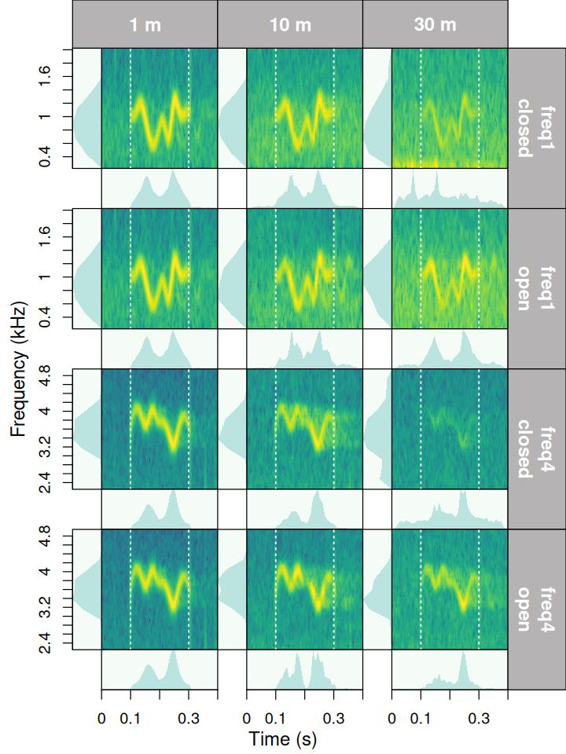
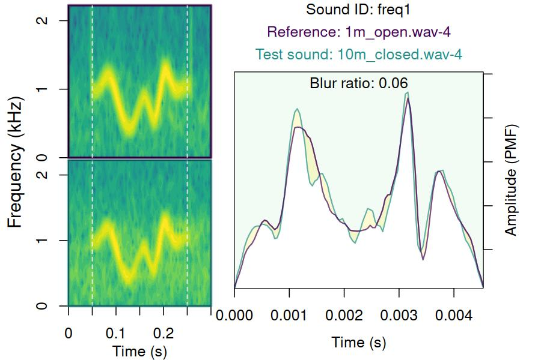
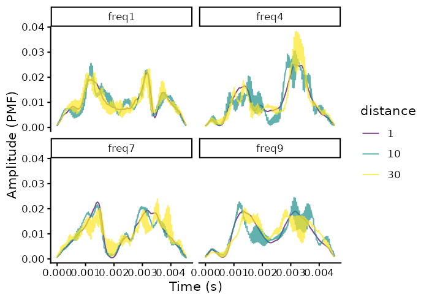
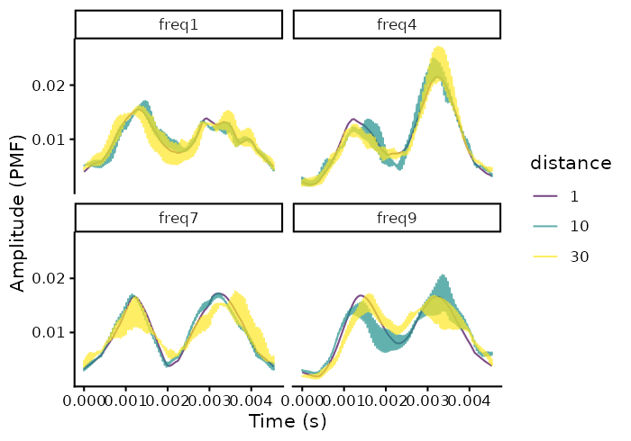
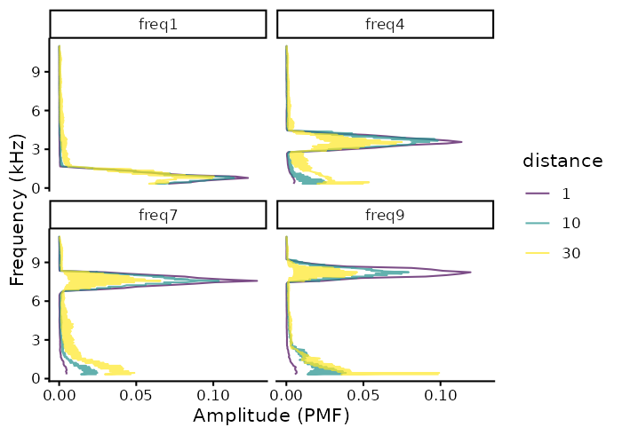
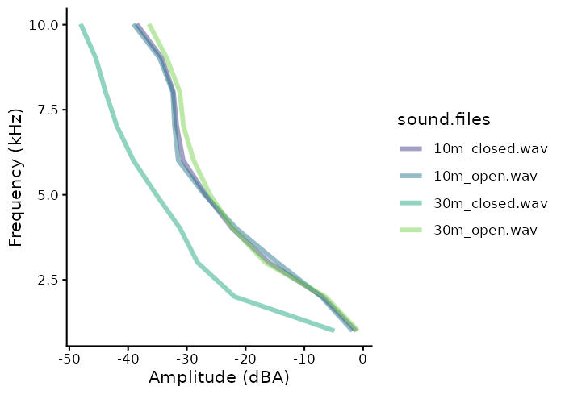
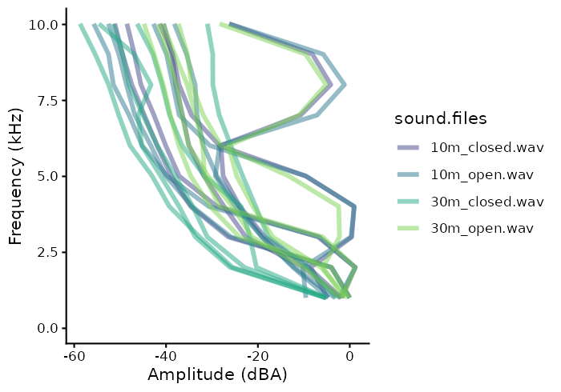
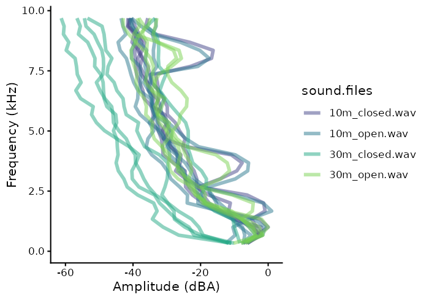

# Quantify degradation

 


**These are key considerations regarding the package behavior when
assessing degradation**:

- The package currently assumes that all recordings have been made with
  the same equipment and recording volume. This will be modified in
  future versions to allow for amplitude calibration of recordings.
- Wave envelope and frequency spectrum calculations are made after
  applying a bandpass filter within the frequency range of the reference
  sound (‘bottom.freq’ and ‘top.freq’ columns)
- The package offers two methods to compare sounds to the reference:
  1.  Compare all sounds with the counterpart that was recorded at the
      closest distance to source (e.g. compare a sound recorded at 5m,
      10m and 15m with its counterpart recorded at 1m). This is the
      default method.
  2.  Compare all sounds with the counterpart recorded at the distance
      immediately before (e.g. a sound recorded at 10m compared with the
      one recorded at 5m, then sound recorded at 15m compared with the
      one recorded at 10m and so on).
- When method 1 is used, the package will attempt to use re-recorded
  sounds from the shortest distance in the same transect as reference.
  However, if there is another re-recorded sound from the same
  ‘sound.id’ at a shorter distance in other transects, it will be used
  as reference instead. This behavior aims to account for the fact that
  in this type of experiments reference sounds are typically recorded at
  1 m and at single transect.
- The package assumes all sound files have the same sampling rate.

### Required data structure

Propagation experiments tend to follow a common experimental design in
which model sounds are re-recorded at increasing distance within a
transect. Hence, the data must indicate, besides the basic acoustic
annotation information (e.g. sound file, time, frequency), the transect
and distance within that transect for each sound.
[baRulho](https://docs.ropensci.org/baRulho//) comes with an example
annotation data set that can be used to show the required data
structure:

``` r

# load packages
library(baRulho)
library(viridis)
library(ggplot2)

# load example data
data("test_sounds_est")

test_sounds_est
```

    Warning: package 'ohun' was built under R version 4.6.1

| sound.files | selec | start | end | bottom.freq | top.freq | sound.id | transect | distance |
|:--:|:--:|:--:|:--:|:--:|:--:|:--:|:--:|:--:|
| 10m_closed.wav | 1 | 0.050000 | 0.200000 | 1.333333 | 2.666667 | ambient | closed | 10 |
| 30m_closed.wav | 1 | 0.050000 | 0.200000 | 1.333333 | 2.666667 | ambient | closed | 30 |
| 10m_open.wav | 1 | 0.050000 | 0.200000 | 1.333333 | 2.666667 | ambient | open | 10 |
| 1m_open.wav | 1 | 0.050000 | 0.200000 | 1.333333 | 2.666667 | ambient | open | 1 |
| 30m_open.wav | 1 | 0.050000 | 0.200000 | 1.333333 | 2.666667 | ambient | open | 30 |
| 10m_closed.wav | 4 | 1.800045 | 2.000068 | 0.422000 | 1.223000 | freq1 | closed | 10 |
| 30m_closed.wav | 4 | 1.800045 | 2.000068 | 0.422000 | 1.223000 | freq1 | closed | 30 |
| 10m_open.wav | 4 | 1.800045 | 2.000068 | 0.422000 | 1.223000 | freq1 | open | 10 |
| 1m_open.wav | 4 | 1.800045 | 2.000068 | 0.422000 | 1.223000 | freq1 | open | 1 |
| 30m_open.wav | 4 | 1.800045 | 2.000068 | 0.422000 | 1.223000 | freq1 | open | 30 |
| 10m_closed.wav | 3 | 1.550023 | 1.750045 | 3.208000 | 4.069000 | freq4 | closed | 10 |
| 30m_closed.wav | 3 | 1.550023 | 1.750045 | 3.208000 | 4.069000 | freq4 | closed | 30 |
| 10m_open.wav | 3 | 1.550023 | 1.750045 | 3.208000 | 4.069000 | freq4 | open | 10 |
| 1m_open.wav | 3 | 1.550023 | 1.750045 | 3.208000 | 4.069000 | freq4 | open | 1 |
| 30m_open.wav | 3 | 1.550023 | 1.750045 | 3.208000 | 4.069000 | freq4 | open | 30 |
| 10m_closed.wav | 5 | 2.050068 | 2.250091 | 6.905000 | 7.917000 | freq7 | closed | 10 |
| 30m_closed.wav | 5 | 2.050068 | 2.250091 | 6.905000 | 7.917000 | freq7 | closed | 30 |
| 10m_open.wav | 5 | 2.050068 | 2.250091 | 6.905000 | 7.917000 | freq7 | open | 10 |
| 1m_open.wav | 5 | 2.050068 | 2.250091 | 6.905000 | 7.917000 | freq7 | open | 1 |
| 30m_open.wav | 5 | 2.050068 | 2.250091 | 6.905000 | 7.917000 | freq7 | open | 30 |
| 10m_closed.wav | 2 | 1.300000 | 1.500023 | 7.875000 | 8.805000 | freq9 | closed | 10 |
| 30m_closed.wav | 2 | 1.300000 | 1.500023 | 7.875000 | 8.805000 | freq9 | closed | 30 |
| 10m_open.wav | 2 | 1.300000 | 1.500023 | 7.875000 | 8.805000 | freq9 | open | 10 |
| 1m_open.wav | 2 | 1.300000 | 1.500023 | 7.875000 | 8.805000 | freq9 | open | 1 |
| 30m_open.wav | 2 | 1.300000 | 1.500023 | 7.875000 | 8.805000 | freq9 | open | 30 |

This is the description of the required input data columns:

1.  **sound.files**: character or factor column with the name of the
    sound files including the file extension (e.g. “rec_1.wav”)
2.  **selec**: numeric, character or factor column with a unique
    identifier (at least within each sound file) for each annotation
    (e.g. 1, 2, 3 or “a”, “b”, “c”)
3.  **start**: numeric column with the start position in time of an
    annotated sound (in seconds)
4.  **end**: numeric column with the end position in time of an
    annotated sound (in seconds)
5.  **bottom.freq**: numeric column with the bottom frequency of the
    frequency range of the annotation (in kHz, used for bandpass
    filtering)
6.  **top.freq**: numeric column with the top frequency of the frequency
    range of the annotation (in kHz, used for bandpass filtering)
7.  **channel**: numeric column with the number of the channel in which
    the annotation is found in a multi-channel sound file (optional, by
    default is 1 if not supplied)
8.  **sound.id**: numeric, character or factor column with the ID of
    sounds used to identify same sounds at different distances and
    transects. Each sound ID can have only one sample at each
    distance/transect combination. The sound id label “ambient” can be
    used to defined annotations in which ambient noise can be measured.
9.  **transect**: numeric, character or factor column with the transect
    ID.
10. **distance**: numeric column with with the distance (in m) from the
    source at which the sound was recorded. The package assumes that
    each distance is replicated once within a transect.

## Setting reference sounds

The combined information from these columns is used to identify the
reference sounds for each test (re-recorded) sound. The function
[`set_reference_sounds()`](https://docs.ropensci.org/baRulho/reference/set_reference_sounds.md)
does exactly that. Hence, **unless you define the reference sound for
each test sound manually,
[`set_reference_sounds()`](https://docs.ropensci.org/baRulho/reference/set_reference_sounds.md)
must always be run before any degradation measuring function**.

There are two possible experimental designs when defining reference
sounds (which is controlled by the argument ‘method’ in
[`set_reference_sounds()`](https://docs.ropensci.org/baRulho/reference/set_reference_sounds.md)):

- 1: compare sounds (by ‘sound.id’) with their counterpart that was
  recorded at the closest distance to source (e.g. compare a sound
  recorded at 5m, 10m and 15m with its counterpart recorded at 1m). This
  is the default method. For this design users can have a single example
  for the shortest distance to be used as reference (for instance at 1m
  as is the case in most studies) The function will try to use
  references from the same transect. However, if there is another test
  sound from the same ‘sound.id’ at a shorter distance in other
  transects, it will be used as reference instead. This behavior aims to
  account for the fact that in this type of experiments reference sounds
  are typically recorded at 1 m and at single transect.
- 2: compare all sounds with their counterpart recorded at the distance
  immediately before within a transect (e.g. a sound recorded at 10m
  compared with the same sound recorded at 5m, then sound recorded at
  15m compared with same sound recorded at 10m and so on).

Also note that some selections are labeled as “ambient” in the
‘sound.id’. These selections refer to ambient (background) noise.
Ambient noise can be used by some functions
(e.g. `signal_to_noise_ratio`) to used the same noise sample for all
test sounds in a sound file.

In this example data there are 4 recordings at increasing distances: 1m,
5m, 10m and 15m:

``` r

# count selection per recordings
unique(test_sounds_est$sound.files)
```

    [1] "10m_closed.wav" "30m_closed.wav" "10m_open.wav"   "1m_open.wav"   
    [5] "30m_open.wav"  

The data contains selections for 5 sounds as well as 1 ambient noise
selections at each distance/recording:

``` r

table(test_sounds_est$sound.id, test_sounds_est$distance)
```

|         |  1  | 10  | 30  |
|:--------|:---:|:---:|:---:|
| ambient |  1  |  2  |  2  |
| freq1   |  1  |  2  |  2  |
| freq4   |  1  |  2  |  2  |
| freq7   |  1  |  2  |  2  |
| freq9   |  1  |  2  |  2  |

 

**baRulho** can take sound file annotations represented in the following
**R** objects:

- Data frames
- Selection tables
- Extended selection tables

The last 2 are annotation specific R classes included in
[warbleR](https://marce10.github.io/warbleR/articles/annotation_data_format.html).
Take a look at this [annotation format
vignette](https://marce10.github.io/warbleR/articles/annotation_data_format.html)
from [warbleR](https://marce10.github.io/warbleR/) for more details on
these formats.

### Measuring degradation

#### Data format

As mention above, the function
[`set_reference_sounds()`](https://docs.ropensci.org/baRulho/reference/set_reference_sounds.md)
is used to determined, for each row in the input data, which sounds
would be used as references. The function can do this using any of the
two methods described above:

``` r

# add reference column
test_sounds_est <- set_reference_sounds(test_sounds_est, method = 1)

# print
test_sounds_est
```

    
[30mcomputing references (step 0 of 0):
[39m

| sound.files | selec | start | end | bottom.freq | top.freq | sound.id | transect | distance | reference |
|:--:|:--:|:--:|:--:|:--:|:--:|:--:|:--:|:--:|:--:|
| 10m_closed.wav | 1 | 0.050000 | 0.200000 | 1.333333 | 2.666667 | ambient | closed | 10 | NA |
| 30m_closed.wav | 1 | 0.050000 | 0.200000 | 1.333333 | 2.666667 | ambient | closed | 30 | NA |
| 10m_open.wav | 1 | 0.050000 | 0.200000 | 1.333333 | 2.666667 | ambient | open | 10 | NA |
| 1m_open.wav | 1 | 0.050000 | 0.200000 | 1.333333 | 2.666667 | ambient | open | 1 | NA |
| 30m_open.wav | 1 | 0.050000 | 0.200000 | 1.333333 | 2.666667 | ambient | open | 30 | NA |
| 10m_closed.wav | 4 | 1.800045 | 2.000068 | 0.422000 | 1.223000 | freq1 | closed | 10 | 1m_open.wav-4 |
| 30m_closed.wav | 4 | 1.800045 | 2.000068 | 0.422000 | 1.223000 | freq1 | closed | 30 | 1m_open.wav-4 |
| 10m_open.wav | 4 | 1.800045 | 2.000068 | 0.422000 | 1.223000 | freq1 | open | 10 | 1m_open.wav-4 |
| 1m_open.wav | 4 | 1.800045 | 2.000068 | 0.422000 | 1.223000 | freq1 | open | 1 | NA |
| 30m_open.wav | 4 | 1.800045 | 2.000068 | 0.422000 | 1.223000 | freq1 | open | 30 | 1m_open.wav-4 |
| 10m_closed.wav | 3 | 1.550023 | 1.750045 | 3.208000 | 4.069000 | freq4 | closed | 10 | 1m_open.wav-3 |
| 30m_closed.wav | 3 | 1.550023 | 1.750045 | 3.208000 | 4.069000 | freq4 | closed | 30 | 1m_open.wav-3 |
| 10m_open.wav | 3 | 1.550023 | 1.750045 | 3.208000 | 4.069000 | freq4 | open | 10 | 1m_open.wav-3 |
| 1m_open.wav | 3 | 1.550023 | 1.750045 | 3.208000 | 4.069000 | freq4 | open | 1 | NA |
| 30m_open.wav | 3 | 1.550023 | 1.750045 | 3.208000 | 4.069000 | freq4 | open | 30 | 1m_open.wav-3 |
| 10m_closed.wav | 5 | 2.050068 | 2.250091 | 6.905000 | 7.917000 | freq7 | closed | 10 | 1m_open.wav-5 |
| 30m_closed.wav | 5 | 2.050068 | 2.250091 | 6.905000 | 7.917000 | freq7 | closed | 30 | 1m_open.wav-5 |
| 10m_open.wav | 5 | 2.050068 | 2.250091 | 6.905000 | 7.917000 | freq7 | open | 10 | 1m_open.wav-5 |
| 1m_open.wav | 5 | 2.050068 | 2.250091 | 6.905000 | 7.917000 | freq7 | open | 1 | NA |
| 30m_open.wav | 5 | 2.050068 | 2.250091 | 6.905000 | 7.917000 | freq7 | open | 30 | 1m_open.wav-5 |
| 10m_closed.wav | 2 | 1.300000 | 1.500023 | 7.875000 | 8.805000 | freq9 | closed | 10 | 1m_open.wav-2 |
| 30m_closed.wav | 2 | 1.300000 | 1.500023 | 7.875000 | 8.805000 | freq9 | closed | 30 | 1m_open.wav-2 |
| 10m_open.wav | 2 | 1.300000 | 1.500023 | 7.875000 | 8.805000 | freq9 | open | 10 | 1m_open.wav-2 |
| 1m_open.wav | 2 | 1.300000 | 1.500023 | 7.875000 | 8.805000 | freq9 | open | 1 | NA |
| 30m_open.wav | 2 | 1.300000 | 1.500023 | 7.875000 | 8.805000 | freq9 | open | 30 | 1m_open.wav-2 |

 

The function adds the column ‘reference’ which is then used by
downstream functions plotting or measuring degradation. Hence it is used
before running any of the degradation functions (including plotting
functions). References are indicated as a the combination of the
‘sound.files’ and ‘selec’ column. For instance, ‘10m.wav-1’ indicates
that the row in which the ‘selec’ column is ‘1’ and the sound file is
‘10m.wav’ should be used as reference. Note that `NAs` are returned for
sounds used as reference and ‘ambient’ noise selections. The function
also checks that the information ‘X’ (the input annotation data) is in
the right format so it won’t produce errors in downstream analysis (see
‘X’ argument description for details on format). The function will
ignore rows in which the sound id column is ‘ambient’, ‘start_marker’ or
‘end_marker’.

#### Visual inspection

The function
[`plot_degradation()`](https://docs.ropensci.org/baRulho/reference/plot_degradation.md)
aims to simplify the visual inspection of sound degradation by producing
multipanel figures (saved as JPEG files in ‘dest.path’) containing
visualizations of each test sound and its reference. Sounds are sorted
by distance (columns) and transect. Visualizations include spectrograms,
amplitude envelopes and power spectra (the last 2 are optional):

``` r

# sort to order panels
test_sounds_est <-
  test_sounds_est[order(test_sounds_est$sound.id,
                        test_sounds_est$transect,
                        decreasing = FALSE),]

# create plots
degrad_imgs <- plot_degradation(test_sounds_est, dest.path = tempdir())
```

    
[30mThe image files have been saved in the directory path '/tmp/Rtmp9pHLW8'
[39m

These are the paths to some of the image files:

``` r

degrad_imgs
```

    [1] "/tmp/Rtmp9pHLW8/plot_degradation_p1.jpeg"
    [2] "/tmp/Rtmp9pHLW8/plot_degradation_p2.jpeg"

… and this is one of the images: 

 

Each row includes all the copies of a sound id for a given transect (the
row label includes the sound id in the first line and transect in the
second line), also including its reference if it comes from another
transect. Ambient noise annotations (sound.id ‘ambient’) are excluded.

#### Blur ratio

Blur ratio quantifies the degradation of sound as a function of the
distortion of the amplitude envelope (time domain) while excluding
changes due to energy attenuation. This measure was first described by
Dabelsteen et al. (1993). Blur ratio is computed as the mismatch between
amplitude envelopes (expressed as probability density functions) of the
reference sound and the re-recorded sound. Low values indicate low
degradation of sounds. The function
[`blur_ratio()`](https://docs.ropensci.org/baRulho/reference/blur_ratio.md)
measures the blur ratio of sounds in which a reference playback has been
re-recorded at different distances. The function compares each sound to
the corresponding reference sound within the supplied frequency range
(e.g. bandpass) of the reference sound (‘bottom.freq’ and ‘top.freq’
columns in ‘X’). The ‘sound.id’ column must be used to tell the function
to only compare sounds belonging to the same category (e.g. song-types).
All sound files (or wave objects in the extended selection table) must
have the same sampling rate so the length of envelopes is comparable.
Blur ratio can be calculated as follows:

``` r

# run blur ratio
br <- blur_ratio(X = test_sounds_est)
```

``` r

# see output
br
```

| sound.files | selec | start | end | bottom.freq | top.freq | sound.id | transect | distance | reference | blur.ratio |
|:--:|:--:|:--:|:--:|:--:|:--:|:--:|:--:|:--:|:--:|:--:|
| 10m_closed.wav | 1 | 0.050000 | 0.200000 | 1.333333 | 2.666667 | ambient | closed | 10 | NA | NA |
| 30m_closed.wav | 1 | 0.050000 | 0.200000 | 1.333333 | 2.666667 | ambient | closed | 30 | NA | NA |
| 10m_open.wav | 1 | 0.050000 | 0.200000 | 1.333333 | 2.666667 | ambient | open | 10 | NA | NA |
| 1m_open.wav | 1 | 0.050000 | 0.200000 | 1.333333 | 2.666667 | ambient | open | 1 | NA | NA |
| 30m_open.wav | 1 | 0.050000 | 0.200000 | 1.333333 | 2.666667 | ambient | open | 30 | NA | NA |
| 10m_closed.wav | 4 | 1.800045 | 2.000068 | 0.422000 | 1.223000 | freq1 | closed | 10 | 1m_open.wav-4 | 0.0566597 |
| 30m_closed.wav | 4 | 1.800045 | 2.000068 | 0.422000 | 1.223000 | freq1 | closed | 30 | 1m_open.wav-4 | 0.0849068 |
| 10m_open.wav | 4 | 1.800045 | 2.000068 | 0.422000 | 1.223000 | freq1 | open | 10 | 1m_open.wav-4 | 0.1207314 |
| 1m_open.wav | 4 | 1.800045 | 2.000068 | 0.422000 | 1.223000 | freq1 | open | 1 | NA | NA |
| 30m_open.wav | 4 | 1.800045 | 2.000068 | 0.422000 | 1.223000 | freq1 | open | 30 | 1m_open.wav-4 | 0.1254130 |
| 10m_closed.wav | 3 | 1.550023 | 1.750045 | 3.208000 | 4.069000 | freq4 | closed | 10 | 1m_open.wav-3 | 0.0958649 |
| 30m_closed.wav | 3 | 1.550023 | 1.750045 | 3.208000 | 4.069000 | freq4 | closed | 30 | 1m_open.wav-3 | 0.0847076 |
| 10m_open.wav | 3 | 1.550023 | 1.750045 | 3.208000 | 4.069000 | freq4 | open | 10 | 1m_open.wav-3 | 0.1930450 |
| 1m_open.wav | 3 | 1.550023 | 1.750045 | 3.208000 | 4.069000 | freq4 | open | 1 | NA | NA |
| 30m_open.wav | 3 | 1.550023 | 1.750045 | 3.208000 | 4.069000 | freq4 | open | 30 | 1m_open.wav-3 | 0.1345533 |
| 10m_closed.wav | 5 | 2.050068 | 2.250091 | 6.905000 | 7.917000 | freq7 | closed | 10 | 1m_open.wav-5 | 0.0709498 |
| 30m_closed.wav | 5 | 2.050068 | 2.250091 | 6.905000 | 7.917000 | freq7 | closed | 30 | 1m_open.wav-5 | 0.1923770 |
| 10m_open.wav | 5 | 2.050068 | 2.250091 | 6.905000 | 7.917000 | freq7 | open | 10 | 1m_open.wav-5 | 0.0767771 |
| 1m_open.wav | 5 | 2.050068 | 2.250091 | 6.905000 | 7.917000 | freq7 | open | 1 | NA | NA |
| 30m_open.wav | 5 | 2.050068 | 2.250091 | 6.905000 | 7.917000 | freq7 | open | 30 | 1m_open.wav-5 | 0.0709116 |
| 10m_closed.wav | 2 | 1.300000 | 1.500023 | 7.875000 | 8.805000 | freq9 | closed | 10 | 1m_open.wav-2 | 0.1075226 |
| 30m_closed.wav | 2 | 1.300000 | 1.500023 | 7.875000 | 8.805000 | freq9 | closed | 30 | 1m_open.wav-2 | 0.1504670 |
| 10m_open.wav | 2 | 1.300000 | 1.500023 | 7.875000 | 8.805000 | freq9 | open | 10 | 1m_open.wav-2 | 0.1344266 |
| 1m_open.wav | 2 | 1.300000 | 1.500023 | 7.875000 | 8.805000 | freq9 | open | 1 | NA | NA |
| 30m_open.wav | 2 | 1.300000 | 1.500023 | 7.875000 | 8.805000 | freq9 | open | 30 | 1m_open.wav-2 | 0.0919376 |

 

The output data frame is simply the input data with an additional column
(‘blur.ratio’) with the blur ratio values. Note again that `NAs` are
returned for sounds used as reference and ‘ambient’ noise selections.

The function
[`plot_blur_ratio()`](https://docs.ropensci.org/baRulho/reference/plot_blur_ratio.md)
can be used to generate image files (in ‘jpeg’ format) for each
comparison showing spectrograms of both sounds and the overlaid
amplitude envelopes (as probability mass functions (PMF)).

``` r

# plot blur ratio
blur_imgs <- plot_blur_ratio(X = test_sounds_est, dest.path = tempdir())
```

    
[30mThe image files have been saved in the directory path '/tmp/Rtmp9pHLW8'
[39m

These are the paths to some of the image files:

``` r

head(blur_imgs)
```

    [1] "/tmp/Rtmp9pHLW8/blur_ratio_freq1-1m_open.wav-4-10m_closed.wav-4.jpeg"
    [2] "/tmp/Rtmp9pHLW8/blur_ratio_freq1-1m_open.wav-4-30m_closed.wav-4.jpeg"
    [3] "/tmp/Rtmp9pHLW8/blur_ratio_freq1-1m_open.wav-4-10m_open.wav-4.jpeg"  
    [4] "/tmp/Rtmp9pHLW8/blur_ratio_freq1-1m_open.wav-4-30m_open.wav-4.jpeg"  
    [5] "/tmp/Rtmp9pHLW8/blur_ratio_freq4-1m_open.wav-3-10m_closed.wav-3.jpeg"
    [6] "/tmp/Rtmp9pHLW8/blur_ratio_freq4-1m_open.wav-3-30m_closed.wav-3.jpeg"

Output image files (in the working directory) look like this one:



 

The image shows the spectrogram for the reference and re-recorded sound,
as well as the envelopes of both sounds overlaid in a single graph.
Colors indicate to which sound spectrograms and envelopes belong to. The
blur ratio value is also displayed.

The function can also return the amplitude spectrum contours when the
argument `envelopes = TRUE`. The contours can be directly input into
ggplot to visualize amplitude envelopes, and how they vary with distance
and across sound types (and ambient noise if included):

``` r

# get envelopes
br <- blur_ratio(X = test_sounds_est, envelopes = TRUE)
envs <- attributes(br)$envelopes

# make distance a factor for plotting
envs$distance <- as.factor(envs$distance)

# plot
ggplot(envs, aes(x = time, y = amp, col = distance)) +
  geom_line() + facet_wrap( ~ sound.id) +
  scale_color_viridis_d(alpha = 0.7) +
  labs(x = "Time (s)", y = "Amplitude (PMF)") +
  theme_classic()
```



The `env.smooth` argument could change envelope shapes and related
measurements, as higher values tend to smooth the envelopes. The
following code sets `env.smooth = 800` which produces smoother
envelopes:

``` r

# get envelopes
br <- blur_ratio(X = test_sounds_est, envelopes = TRUE, env.smooth = 800)
envs <- attributes(br)$envelopes

envs$distance <- as.factor(envs$distance)

ggplot(envs, aes(x = time, y = amp, col = distance)) +
  geom_line() +
  facet_wrap( ~ sound.id) +
  scale_color_viridis_d(alpha = 0.7) +
  labs(x = "Time (s)", y = "Amplitude (PMF)") +
  theme_classic()
```



 

#### Spectrum blur ratio

Spectrum blur ratio (measured by
[`spectrum_blur_ratio()`](https://docs.ropensci.org/baRulho/reference/spectrum_blur_ratio.md))
quantifies the degradation of sound as a function of the change in sound
energy across the frequency domain, analogous to the blur ratio
described above for the time domain (and implemented in
[`blur_ratio()`](https://docs.ropensci.org/baRulho/reference/blur_ratio.md)).
Low values also indicate low degradation of sounds. Spectrum blur ratio
is measured as the mismatch between power spectra (expressed as
probability density functions) of the reference sound and the
re-recorded sound. It works in the same way than
[`blur_ratio()`](https://docs.ropensci.org/baRulho/reference/blur_ratio.md),
comparing each sound to the corresponding reference sound, and the
output and images are alike as well.

Spectrum blur ratio can be calculated as follows:

``` r

# run Spectrum blur ratio
sbr <- spectrum_blur_ratio(test_sounds_est)
```

``` r

# see output
sbr
```

| sound.files | selec | start | end | bottom.freq | top.freq | sound.id | transect | distance | reference | spectrum.blur.ratio |
|:--:|:--:|:--:|:--:|:--:|:--:|:--:|:--:|:--:|:--:|:--:|
| 10m_closed.wav | 1 | 0.050000 | 0.200000 | 1.333333 | 2.666667 | ambient | closed | 10 | NA | NA |
| 30m_closed.wav | 1 | 0.050000 | 0.200000 | 1.333333 | 2.666667 | ambient | closed | 30 | NA | NA |
| 10m_open.wav | 1 | 0.050000 | 0.200000 | 1.333333 | 2.666667 | ambient | open | 10 | NA | NA |
| 1m_open.wav | 1 | 0.050000 | 0.200000 | 1.333333 | 2.666667 | ambient | open | 1 | NA | NA |
| 30m_open.wav | 1 | 0.050000 | 0.200000 | 1.333333 | 2.666667 | ambient | open | 30 | NA | NA |
| 10m_closed.wav | 4 | 1.800045 | 2.000068 | 0.422000 | 1.223000 | freq1 | closed | 10 | 1m_open.wav-4 | 0.0290863 |
| 30m_closed.wav | 4 | 1.800045 | 2.000068 | 0.422000 | 1.223000 | freq1 | closed | 30 | 1m_open.wav-4 | 0.0524915 |
| 10m_open.wav | 4 | 1.800045 | 2.000068 | 0.422000 | 1.223000 | freq1 | open | 10 | 1m_open.wav-4 | 0.0406274 |
| 1m_open.wav | 4 | 1.800045 | 2.000068 | 0.422000 | 1.223000 | freq1 | open | 1 | NA | NA |
| 30m_open.wav | 4 | 1.800045 | 2.000068 | 0.422000 | 1.223000 | freq1 | open | 30 | 1m_open.wav-4 | 0.0771104 |
| 10m_closed.wav | 3 | 1.550023 | 1.750045 | 3.208000 | 4.069000 | freq4 | closed | 10 | 1m_open.wav-3 | 0.0373389 |
| 30m_closed.wav | 3 | 1.550023 | 1.750045 | 3.208000 | 4.069000 | freq4 | closed | 30 | 1m_open.wav-3 | 0.0375922 |
| 10m_open.wav | 3 | 1.550023 | 1.750045 | 3.208000 | 4.069000 | freq4 | open | 10 | 1m_open.wav-3 | 0.0511878 |
| 1m_open.wav | 3 | 1.550023 | 1.750045 | 3.208000 | 4.069000 | freq4 | open | 1 | NA | NA |
| 30m_open.wav | 3 | 1.550023 | 1.750045 | 3.208000 | 4.069000 | freq4 | open | 30 | 1m_open.wav-3 | 0.0513809 |
| 10m_closed.wav | 5 | 2.050068 | 2.250091 | 6.905000 | 7.917000 | freq7 | closed | 10 | 1m_open.wav-5 | 0.0315084 |
| 30m_closed.wav | 5 | 2.050068 | 2.250091 | 6.905000 | 7.917000 | freq7 | closed | 30 | 1m_open.wav-5 | 0.0958100 |
| 10m_open.wav | 5 | 2.050068 | 2.250091 | 6.905000 | 7.917000 | freq7 | open | 10 | 1m_open.wav-5 | 0.0117749 |
| 1m_open.wav | 5 | 2.050068 | 2.250091 | 6.905000 | 7.917000 | freq7 | open | 1 | NA | NA |
| 30m_open.wav | 5 | 2.050068 | 2.250091 | 6.905000 | 7.917000 | freq7 | open | 30 | 1m_open.wav-5 | 0.0373253 |
| 10m_closed.wav | 2 | 1.300000 | 1.500023 | 7.875000 | 8.805000 | freq9 | closed | 10 | 1m_open.wav-2 | 0.0266188 |
| 30m_closed.wav | 2 | 1.300000 | 1.500023 | 7.875000 | 8.805000 | freq9 | closed | 30 | 1m_open.wav-2 | 0.0421037 |
| 10m_open.wav | 2 | 1.300000 | 1.500023 | 7.875000 | 8.805000 | freq9 | open | 10 | 1m_open.wav-2 | 0.0716653 |
| 1m_open.wav | 2 | 1.300000 | 1.500023 | 7.875000 | 8.805000 | freq9 | open | 1 | NA | NA |
| 30m_open.wav | 2 | 1.300000 | 1.500023 | 7.875000 | 8.805000 | freq9 | open | 30 | 1m_open.wav-2 | 0.0302866 |

 

As in
[`blur_ratio()`](https://docs.ropensci.org/baRulho/reference/blur_ratio.md),
[`spectrum_blur_ratio()`](https://docs.ropensci.org/baRulho/reference/spectrum_blur_ratio.md)
can also return the amplitude spectrum contours with the argument
`spectra = TRUE`:

``` r

sbr <- spectrum_blur_ratio(X = test_sounds_est, spectra = TRUE)

spctr <- attributes(sbr)$spectra

spctr$distance <- as.factor(spctr$distance)

ggplot(spctr[spctr$freq > 0.3,], aes(y = amp, x = freq, col = distance)) +
  geom_line() +
  facet_wrap( ~ sound.id) +
  scale_color_viridis_d(alpha = 0.7) +
  labs(x = "Frequency (kHz)", y = "Amplitude (PMF)") +
  coord_flip() +
  theme_classic()
```



 

#### Excess attenuation

With every doubling of distance, sounds attenuate with a 6 dB loss of
amplitude (Morton, 1975; Marten & Marler, 1977). Any additional loss of
amplitude results in excess attenuation, or energy loss in excess of
that expected to occur with distance via spherical spreading, due to
atmospheric conditions or habitat (Wiley & Richards, 1978). This
degradation metric can be measured using the
[`excess_attenuation()`](https://docs.ropensci.org/baRulho/reference/excess_attenuation.md)
function. Low values indicate little sound attenuation. The function
will then compare each sound to the corresponding reference sound within
the frequency range (e.g. bandpass) of the reference sound
(‘bottom.freq’ and ‘top.freq’ columns in ‘X’).

[`excess_attenuation()`](https://docs.ropensci.org/baRulho/reference/excess_attenuation.md)
can be measured like this:

``` r

# run  envelope correlation
ea <- excess_attenuation(test_sounds_est)
```

The output, similar to those of other functions, is an extended
selection table with the input data, but also including two new columns
(‘reference’ and ‘excess.attenuation’) with the reference sound and the
excess attenuation:

``` r

# print output
ea
```

| sound.files | selec | start | end | bottom.freq | top.freq | sound.id | transect | distance | reference | excess.attenuation |
|:--:|:--:|:--:|:--:|:--:|:--:|:--:|:--:|:--:|:--:|:--:|
| 10m_closed.wav | 1 | 0.050000 | 0.200000 | 1.333333 | 2.666667 | ambient | closed | 10 | NA | NA |
| 30m_closed.wav | 1 | 0.050000 | 0.200000 | 1.333333 | 2.666667 | ambient | closed | 30 | NA | NA |
| 10m_open.wav | 1 | 0.050000 | 0.200000 | 1.333333 | 2.666667 | ambient | open | 10 | NA | NA |
| 1m_open.wav | 1 | 0.050000 | 0.200000 | 1.333333 | 2.666667 | ambient | open | 1 | NA | NA |
| 30m_open.wav | 1 | 0.050000 | 0.200000 | 1.333333 | 2.666667 | ambient | open | 30 | NA | NA |
| 10m_closed.wav | 4 | 1.800045 | 2.000068 | 0.422000 | 1.223000 | freq1 | closed | 10 | 1m_open.wav-4 | -12.5107538 |
| 30m_closed.wav | 4 | 1.800045 | 2.000068 | 0.422000 | 1.223000 | freq1 | closed | 30 | 1m_open.wav-4 | -17.5992177 |
| 10m_open.wav | 4 | 1.800045 | 2.000068 | 0.422000 | 1.223000 | freq1 | open | 10 | 1m_open.wav-4 | -13.1624863 |
| 1m_open.wav | 4 | 1.800045 | 2.000068 | 0.422000 | 1.223000 | freq1 | open | 1 | NA | NA |
| 30m_open.wav | 4 | 1.800045 | 2.000068 | 0.422000 | 1.223000 | freq1 | open | 30 | 1m_open.wav-4 | -14.3428912 |
| 10m_closed.wav | 3 | 1.550023 | 1.750045 | 3.208000 | 4.069000 | freq4 | closed | 10 | 1m_open.wav-3 | -9.6475480 |
| 30m_closed.wav | 3 | 1.550023 | 1.750045 | 3.208000 | 4.069000 | freq4 | closed | 30 | 1m_open.wav-3 | -1.6012932 |
| 10m_open.wav | 3 | 1.550023 | 1.750045 | 3.208000 | 4.069000 | freq4 | open | 10 | 1m_open.wav-3 | -12.3666608 |
| 1m_open.wav | 3 | 1.550023 | 1.750045 | 3.208000 | 4.069000 | freq4 | open | 1 | NA | NA |
| 30m_open.wav | 3 | 1.550023 | 1.750045 | 3.208000 | 4.069000 | freq4 | open | 30 | 1m_open.wav-3 | -12.7808558 |
| 10m_closed.wav | 5 | 2.050068 | 2.250091 | 6.905000 | 7.917000 | freq7 | closed | 10 | 1m_open.wav-5 | -9.7543558 |
| 30m_closed.wav | 5 | 2.050068 | 2.250091 | 6.905000 | 7.917000 | freq7 | closed | 30 | 1m_open.wav-5 | 0.9463683 |
| 10m_open.wav | 5 | 2.050068 | 2.250091 | 6.905000 | 7.917000 | freq7 | open | 10 | 1m_open.wav-5 | -9.9278602 |
| 1m_open.wav | 5 | 2.050068 | 2.250091 | 6.905000 | 7.917000 | freq7 | open | 1 | NA | NA |
| 30m_open.wav | 5 | 2.050068 | 2.250091 | 6.905000 | 7.917000 | freq7 | open | 30 | 1m_open.wav-5 | -8.2325649 |
| 10m_closed.wav | 2 | 1.300000 | 1.500023 | 7.875000 | 8.805000 | freq9 | closed | 10 | 1m_open.wav-2 | -1.8595989 |
| 30m_closed.wav | 2 | 1.300000 | 1.500023 | 7.875000 | 8.805000 | freq9 | closed | 30 | 1m_open.wav-2 | 6.1574396 |
| 10m_open.wav | 2 | 1.300000 | 1.500023 | 7.875000 | 8.805000 | freq9 | open | 10 | 1m_open.wav-2 | -5.8921147 |
| 1m_open.wav | 2 | 1.300000 | 1.500023 | 7.875000 | 8.805000 | freq9 | open | 1 | NA | NA |
| 30m_open.wav | 2 | 1.300000 | 1.500023 | 7.875000 | 8.805000 | freq9 | open | 30 | 1m_open.wav-2 | -8.8725801 |

 

#### Envelope correlation

Amplitude envelope correlation measures the similarity of two sounds in
the time domain. The
[`envelope_correlation()`](https://docs.ropensci.org/baRulho/reference/envelope_correlation.md)
function measures the envelope correlation coefficients between
reference playback and re-recorded sounds. Values close to 1 means very
similar amplitude envelopes (i.e. little degradation has occurred). If
envelopes have different lengths (that is when sounds have different
lengths) cross-correlation is applied and the maximum correlation
coefficient is returned. Cross-correlation is achieved by sliding the
shortest sound along the largest one and calculating the correlation at
each step. As in the functions detailed above, ‘sound.id’ column must be
used to instruct the function to only compare sounds that belong to the
same category.

[`envelope_correlation()`](https://docs.ropensci.org/baRulho/reference/envelope_correlation.md)
can be run as follows:

``` r

# run  envelope correlation
ec <- envelope_correlation(test_sounds_est)
```

The output is also similar to those of other functions; an extended
selection table similar to input data, but also includes two new columns
(‘reference’ and ‘envelope.correlation’) with the reference sound and
the amplitude envelope correlation coefficients:

``` r

# print output
ec
```

| sound.files | selec | start | end | bottom.freq | top.freq | sound.id | transect | distance | reference | excess.attenuation |
|:--:|:--:|:--:|:--:|:--:|:--:|:--:|:--:|:--:|:--:|:--:|
| 10m_closed.wav | 1 | 0.050000 | 0.200000 | 1.333333 | 2.666667 | ambient | closed | 10 | NA | NA |
| 30m_closed.wav | 1 | 0.050000 | 0.200000 | 1.333333 | 2.666667 | ambient | closed | 30 | NA | NA |
| 10m_open.wav | 1 | 0.050000 | 0.200000 | 1.333333 | 2.666667 | ambient | open | 10 | NA | NA |
| 1m_open.wav | 1 | 0.050000 | 0.200000 | 1.333333 | 2.666667 | ambient | open | 1 | NA | NA |
| 30m_open.wav | 1 | 0.050000 | 0.200000 | 1.333333 | 2.666667 | ambient | open | 30 | NA | NA |
| 10m_closed.wav | 4 | 1.800045 | 2.000068 | 0.422000 | 1.223000 | freq1 | closed | 10 | 1m_open.wav-4 | -12.5107538 |
| 30m_closed.wav | 4 | 1.800045 | 2.000068 | 0.422000 | 1.223000 | freq1 | closed | 30 | 1m_open.wav-4 | -17.5992177 |
| 10m_open.wav | 4 | 1.800045 | 2.000068 | 0.422000 | 1.223000 | freq1 | open | 10 | 1m_open.wav-4 | -13.1624863 |
| 1m_open.wav | 4 | 1.800045 | 2.000068 | 0.422000 | 1.223000 | freq1 | open | 1 | NA | NA |
| 30m_open.wav | 4 | 1.800045 | 2.000068 | 0.422000 | 1.223000 | freq1 | open | 30 | 1m_open.wav-4 | -14.3428912 |
| 10m_closed.wav | 3 | 1.550023 | 1.750045 | 3.208000 | 4.069000 | freq4 | closed | 10 | 1m_open.wav-3 | -9.6475480 |
| 30m_closed.wav | 3 | 1.550023 | 1.750045 | 3.208000 | 4.069000 | freq4 | closed | 30 | 1m_open.wav-3 | -1.6012932 |
| 10m_open.wav | 3 | 1.550023 | 1.750045 | 3.208000 | 4.069000 | freq4 | open | 10 | 1m_open.wav-3 | -12.3666608 |
| 1m_open.wav | 3 | 1.550023 | 1.750045 | 3.208000 | 4.069000 | freq4 | open | 1 | NA | NA |
| 30m_open.wav | 3 | 1.550023 | 1.750045 | 3.208000 | 4.069000 | freq4 | open | 30 | 1m_open.wav-3 | -12.7808558 |
| 10m_closed.wav | 5 | 2.050068 | 2.250091 | 6.905000 | 7.917000 | freq7 | closed | 10 | 1m_open.wav-5 | -9.7543558 |
| 30m_closed.wav | 5 | 2.050068 | 2.250091 | 6.905000 | 7.917000 | freq7 | closed | 30 | 1m_open.wav-5 | 0.9463683 |
| 10m_open.wav | 5 | 2.050068 | 2.250091 | 6.905000 | 7.917000 | freq7 | open | 10 | 1m_open.wav-5 | -9.9278602 |
| 1m_open.wav | 5 | 2.050068 | 2.250091 | 6.905000 | 7.917000 | freq7 | open | 1 | NA | NA |
| 30m_open.wav | 5 | 2.050068 | 2.250091 | 6.905000 | 7.917000 | freq7 | open | 30 | 1m_open.wav-5 | -8.2325649 |
| 10m_closed.wav | 2 | 1.300000 | 1.500023 | 7.875000 | 8.805000 | freq9 | closed | 10 | 1m_open.wav-2 | -1.8595989 |
| 30m_closed.wav | 2 | 1.300000 | 1.500023 | 7.875000 | 8.805000 | freq9 | closed | 30 | 1m_open.wav-2 | 6.1574396 |
| 10m_open.wav | 2 | 1.300000 | 1.500023 | 7.875000 | 8.805000 | freq9 | open | 10 | 1m_open.wav-2 | -5.8921147 |
| 1m_open.wav | 2 | 1.300000 | 1.500023 | 7.875000 | 8.805000 | freq9 | open | 1 | NA | NA |
| 30m_open.wav | 2 | 1.300000 | 1.500023 | 7.875000 | 8.805000 | freq9 | open | 30 | 1m_open.wav-2 | -8.8725801 |

 

Note that this function doesn’t provide a graphical output. However, the
graphs generated by
[`blur_ratio()`](https://docs.ropensci.org/baRulho/reference/blur_ratio.md)
can be used to inspect the envelope shapes and the alignment of sounds.

#### Spectrum correlation

Spectrum correlation measures the similarity of two sounds in the
frequency domain. This is similar to
[`envelope_correlation()`](https://docs.ropensci.org/baRulho/reference/envelope_correlation.md),
but in the frequency domain. Both sounds are compared within the
frequency range of the reference sound (so both spectra have the same
length). Again, values near 1 indicate identical frequency spectrum
(i.e. no degradation).

``` r

# run spectrum correlation
sc <- spectrum_correlation(test_sounds_est)
```

The output is also similar to that of
[`envelope_correlation()`](https://docs.ropensci.org/baRulho/reference/envelope_correlation.md):

``` r

# print output
sc
```

| sound.files | selec | start | end | bottom.freq | top.freq | sound.id | transect | distance | reference | spectrum.correlation |
|:--:|:--:|:--:|:--:|:--:|:--:|:--:|:--:|:--:|:--:|:--:|
| 10m_closed.wav | 1 | 0.050000 | 0.200000 | 1.333333 | 2.666667 | ambient | closed | 10 | NA | NA |
| 30m_closed.wav | 1 | 0.050000 | 0.200000 | 1.333333 | 2.666667 | ambient | closed | 30 | NA | NA |
| 10m_open.wav | 1 | 0.050000 | 0.200000 | 1.333333 | 2.666667 | ambient | open | 10 | NA | NA |
| 1m_open.wav | 1 | 0.050000 | 0.200000 | 1.333333 | 2.666667 | ambient | open | 1 | NA | NA |
| 30m_open.wav | 1 | 0.050000 | 0.200000 | 1.333333 | 2.666667 | ambient | open | 30 | NA | NA |
| 10m_closed.wav | 4 | 1.800045 | 2.000068 | 0.422000 | 1.223000 | freq1 | closed | 10 | 1m_open.wav-4 | 0.9983597 |
| 30m_closed.wav | 4 | 1.800045 | 2.000068 | 0.422000 | 1.223000 | freq1 | closed | 30 | 1m_open.wav-4 | -0.0609972 |
| 10m_open.wav | 4 | 1.800045 | 2.000068 | 0.422000 | 1.223000 | freq1 | open | 10 | 1m_open.wav-4 | 0.9466352 |
| 1m_open.wav | 4 | 1.800045 | 2.000068 | 0.422000 | 1.223000 | freq1 | open | 1 | NA | NA |
| 30m_open.wav | 4 | 1.800045 | 2.000068 | 0.422000 | 1.223000 | freq1 | open | 30 | 1m_open.wav-4 | 0.9776356 |
| 10m_closed.wav | 3 | 1.550023 | 1.750045 | 3.208000 | 4.069000 | freq4 | closed | 10 | 1m_open.wav-3 | 0.9558702 |
| 30m_closed.wav | 3 | 1.550023 | 1.750045 | 3.208000 | 4.069000 | freq4 | closed | 30 | 1m_open.wav-3 | 0.7311193 |
| 10m_open.wav | 3 | 1.550023 | 1.750045 | 3.208000 | 4.069000 | freq4 | open | 10 | 1m_open.wav-3 | 0.8872755 |
| 1m_open.wav | 3 | 1.550023 | 1.750045 | 3.208000 | 4.069000 | freq4 | open | 1 | NA | NA |
| 30m_open.wav | 3 | 1.550023 | 1.750045 | 3.208000 | 4.069000 | freq4 | open | 30 | 1m_open.wav-3 | 0.7881992 |
| 10m_closed.wav | 5 | 2.050068 | 2.250091 | 6.905000 | 7.917000 | freq7 | closed | 10 | 1m_open.wav-5 | 0.9997165 |
| 30m_closed.wav | 5 | 2.050068 | 2.250091 | 6.905000 | 7.917000 | freq7 | closed | 30 | 1m_open.wav-5 | 0.9749093 |
| 10m_open.wav | 5 | 2.050068 | 2.250091 | 6.905000 | 7.917000 | freq7 | open | 10 | 1m_open.wav-5 | 0.9906310 |
| 1m_open.wav | 5 | 2.050068 | 2.250091 | 6.905000 | 7.917000 | freq7 | open | 1 | NA | NA |
| 30m_open.wav | 5 | 2.050068 | 2.250091 | 6.905000 | 7.917000 | freq7 | open | 30 | 1m_open.wav-5 | 0.9866226 |
| 10m_closed.wav | 2 | 1.300000 | 1.500023 | 7.875000 | 8.805000 | freq9 | closed | 10 | 1m_open.wav-2 | 0.9818309 |
| 30m_closed.wav | 2 | 1.300000 | 1.500023 | 7.875000 | 8.805000 | freq9 | closed | 30 | 1m_open.wav-2 | 0.9947720 |
| 10m_open.wav | 2 | 1.300000 | 1.500023 | 7.875000 | 8.805000 | freq9 | open | 10 | 1m_open.wav-2 | 0.9980480 |
| 1m_open.wav | 2 | 1.300000 | 1.500023 | 7.875000 | 8.805000 | freq9 | open | 1 | NA | NA |
| 30m_open.wav | 2 | 1.300000 | 1.500023 | 7.875000 | 8.805000 | freq9 | open | 30 | 1m_open.wav-2 | 0.9965715 |

 

As in
[`envelope_correlation()`](https://docs.ropensci.org/baRulho/reference/envelope_correlation.md),
[`spectrum_correlation()`](https://docs.ropensci.org/baRulho/reference/spectrum_correlation.md)
doesn’t provide a graphical output. However, the graphs generated by
[`spectrum_blur_ratio()`](https://docs.ropensci.org/baRulho/reference/spectrum_blur_ratio.md)
can also be used to inspect the spectrum shapes and the sound alignment.

#### Signal-to-noise ratio

Signal-to-noise ratio (SNR) quantifies sound amplitude level in relation
to ambient noise as a metric of overall sound attenuation. Therefore,
attenuation refers to the loss of energy as described by Dabelsteen et
al (1993). This method is implemented in the function
[`signal_to_noise_ratio()`](https://docs.ropensci.org/baRulho/reference/signal_to_noise_ratio.md),
which uses envelopes to quantify the sound power for signals and
background noise. The function requires a measurement of ambient noise,
which could either be the noise right before each sound
(`noise.ref = "adjacent"`) or one or more ambient noise measurements per
recording (`noise.ref = "custom"`). For the latter, selections on sound
parameters in which ambient noise will be measured must be specified.
Alternatively, one or more selections of ambient noise can be used as
reference (see ‘noise.ref’ argument). This can potentially provide a
more accurate representation of ambient noise. When margins overlap with
another acoustic signal nearby, SNR will be inaccurate, so margin length
should be carefully considered. Any SNR less than or equal to one
suggests background noise is equal to or overpowering the acoustic
signal. SNR can be measured as follows:

``` r

# run signal to noise ratio
snr <-
  signal_to_noise_ratio(test_sounds_est,
                        pb = FALSE,
                        noise.ref = "custom",
                        mar = 0.1)
```

The output is also similar to the other functions:

``` r

# print output
snr
```

| sound.files | selec | start | end | bottom.freq | top.freq | sound.id | transect | distance | reference | signal.to.noise.ratio |
|:--:|:--:|:--:|:--:|:--:|:--:|:--:|:--:|:--:|:--:|:--:|
| 10m_closed.wav | 1 | 0.050000 | 0.200000 | 1.333333 | 2.666667 | ambient | closed | 10 | NA | NA |
| 30m_closed.wav | 1 | 0.050000 | 0.200000 | 1.333333 | 2.666667 | ambient | closed | 30 | NA | NA |
| 10m_open.wav | 1 | 0.050000 | 0.200000 | 1.333333 | 2.666667 | ambient | open | 10 | NA | NA |
| 1m_open.wav | 1 | 0.050000 | 0.200000 | 1.333333 | 2.666667 | ambient | open | 1 | NA | NA |
| 30m_open.wav | 1 | 0.050000 | 0.200000 | 1.333333 | 2.666667 | ambient | open | 30 | NA | NA |
| 10m_closed.wav | 4 | 1.800045 | 2.000068 | 0.422000 | 1.223000 | freq1 | closed | 10 | 1m_open.wav-4 | 15.0140795 |
| 30m_closed.wav | 4 | 1.800045 | 2.000068 | 0.422000 | 1.223000 | freq1 | closed | 30 | 1m_open.wav-4 | -7.3194710 |
| 10m_open.wav | 4 | 1.800045 | 2.000068 | 0.422000 | 1.223000 | freq1 | open | 10 | 1m_open.wav-4 | 18.6300887 |
| 1m_open.wav | 4 | 1.800045 | 2.000068 | 0.422000 | 1.223000 | freq1 | open | 1 | NA | 25.2040533 |
| 30m_open.wav | 4 | 1.800045 | 2.000068 | 0.422000 | 1.223000 | freq1 | open | 30 | 1m_open.wav-4 | 6.2497775 |
| 10m_closed.wav | 3 | 1.550023 | 1.750045 | 3.208000 | 4.069000 | freq4 | closed | 10 | 1m_open.wav-3 | 10.3757926 |
| 30m_closed.wav | 3 | 1.550023 | 1.750045 | 3.208000 | 4.069000 | freq4 | closed | 30 | 1m_open.wav-3 | -23.6573391 |
| 10m_open.wav | 3 | 1.550023 | 1.750045 | 3.208000 | 4.069000 | freq4 | open | 10 | 1m_open.wav-3 | 16.8352930 |
| 1m_open.wav | 3 | 1.550023 | 1.750045 | 3.208000 | 4.069000 | freq4 | open | 1 | NA | 23.8308618 |
| 30m_open.wav | 3 | 1.550023 | 1.750045 | 3.208000 | 4.069000 | freq4 | open | 30 | 1m_open.wav-3 | 2.6671788 |
| 10m_closed.wav | 5 | 2.050068 | 2.250091 | 6.905000 | 7.917000 | freq7 | closed | 10 | 1m_open.wav-5 | -0.2872684 |
| 30m_closed.wav | 5 | 2.050068 | 2.250091 | 6.905000 | 7.917000 | freq7 | closed | 30 | 1m_open.wav-5 | -37.8714516 |
| 10m_open.wav | 5 | 2.050068 | 2.250091 | 6.905000 | 7.917000 | freq7 | open | 10 | 1m_open.wav-5 | 3.3664871 |
| 1m_open.wav | 5 | 2.050068 | 2.250091 | 6.905000 | 7.917000 | freq7 | open | 1 | NA | 12.9396862 |
| 30m_open.wav | 5 | 2.050068 | 2.250091 | 6.905000 | 7.917000 | freq7 | open | 30 | 1m_open.wav-5 | -12.4579158 |
| 10m_closed.wav | 2 | 1.300000 | 1.500023 | 7.875000 | 8.805000 | freq9 | closed | 10 | 1m_open.wav-2 | -4.0232758 |
| 30m_closed.wav | 2 | 1.300000 | 1.500023 | 7.875000 | 8.805000 | freq9 | closed | 30 | 1m_open.wav-2 | -38.6680143 |
| 10m_open.wav | 2 | 1.300000 | 1.500023 | 7.875000 | 8.805000 | freq9 | open | 10 | 1m_open.wav-2 | 3.5736359 |
| 1m_open.wav | 2 | 1.300000 | 1.500023 | 7.875000 | 8.805000 | freq9 | open | 1 | NA | 17.2034424 |
| 30m_open.wav | 2 | 1.300000 | 1.500023 | 7.875000 | 8.805000 | freq9 | open | 30 | 1m_open.wav-2 | -7.5582795 |

 

Negative values can occur when the background noise measured has higher
power than the signal. Note that this function does not compare sounds
to references, so no reference column is added.

#### Tail-to-signal ratio

Tail-to-signal ratio (TSR) is used to quantify reverberations.
Specifically TSR measures the ratio of energy in the reverberation tail
(the time segment right after the sound) to energy in the sound. A
general margin in which reverberation tail will be measured must be
specified. The function will measure TSR within the supplied frequency
range (e.g. bandpass) of the reference sound (‘bottom.freq’ and
‘top.freq’ columns in ‘X’). Two methods for calculating reverberations
are provided (see ‘type’ argument). `Type 1` is based on the original
description of TSR in Dabelsteen et al. (1993) while `type 2` is better
referred to as “tail-to-noise ratio”, given that it compares the
amplitude of tails to those of ambient noise. For both types higher
values represent more reverberations. TSR can be measured as follows:

``` r

# run tail to signal ratio
tsr <- tail_to_signal_ratio(test_sounds_est, tsr.formula = 1, mar = 0.05)
```

Again, the output is similar to other functions:

``` r

# print output

tsr
```

| sound.files | selec | start | end | bottom.freq | top.freq | sound.id | transect | distance | reference | tail.to.signal.ratio |
|:--:|:--:|:--:|:--:|:--:|:--:|:--:|:--:|:--:|:--:|:--:|
| 10m_closed.wav | 1 | 0.050000 | 0.200000 | 1.333333 | 2.666667 | ambient | closed | 10 | NA | NA |
| 30m_closed.wav | 1 | 0.050000 | 0.200000 | 1.333333 | 2.666667 | ambient | closed | 30 | NA | NA |
| 10m_open.wav | 1 | 0.050000 | 0.200000 | 1.333333 | 2.666667 | ambient | open | 10 | NA | NA |
| 1m_open.wav | 1 | 0.050000 | 0.200000 | 1.333333 | 2.666667 | ambient | open | 1 | NA | NA |
| 30m_open.wav | 1 | 0.050000 | 0.200000 | 1.333333 | 2.666667 | ambient | open | 30 | NA | NA |
| 10m_closed.wav | 4 | 1.800045 | 2.000068 | 0.422000 | 1.223000 | freq1 | closed | 10 | 1m_open.wav-4 | -17.601030 |
| 30m_closed.wav | 4 | 1.800045 | 2.000068 | 0.422000 | 1.223000 | freq1 | closed | 30 | 1m_open.wav-4 | -6.897373 |
| 10m_open.wav | 4 | 1.800045 | 2.000068 | 0.422000 | 1.223000 | freq1 | open | 10 | 1m_open.wav-4 | -13.619545 |
| 1m_open.wav | 4 | 1.800045 | 2.000068 | 0.422000 | 1.223000 | freq1 | open | 1 | NA | -25.749053 |
| 30m_open.wav | 4 | 1.800045 | 2.000068 | 0.422000 | 1.223000 | freq1 | open | 30 | 1m_open.wav-4 | -9.288438 |
| 10m_closed.wav | 3 | 1.550023 | 1.750045 | 3.208000 | 4.069000 | freq4 | closed | 10 | 1m_open.wav-3 | -23.773865 |
| 30m_closed.wav | 3 | 1.550023 | 1.750045 | 3.208000 | 4.069000 | freq4 | closed | 30 | 1m_open.wav-3 | -7.546368 |
| 10m_open.wav | 3 | 1.550023 | 1.750045 | 3.208000 | 4.069000 | freq4 | open | 10 | 1m_open.wav-3 | -24.588476 |
| 1m_open.wav | 3 | 1.550023 | 1.750045 | 3.208000 | 4.069000 | freq4 | open | 1 | NA | -31.022133 |
| 30m_open.wav | 3 | 1.550023 | 1.750045 | 3.208000 | 4.069000 | freq4 | open | 30 | 1m_open.wav-3 | -19.867073 |
| 10m_closed.wav | 5 | 2.050068 | 2.250091 | 6.905000 | 7.917000 | freq7 | closed | 10 | 1m_open.wav-5 | -26.099051 |
| 30m_closed.wav | 5 | 2.050068 | 2.250091 | 6.905000 | 7.917000 | freq7 | closed | 30 | 1m_open.wav-5 | -2.503217 |
| 10m_open.wav | 5 | 2.050068 | 2.250091 | 6.905000 | 7.917000 | freq7 | open | 10 | 1m_open.wav-5 | -25.610614 |
| 1m_open.wav | 5 | 2.050068 | 2.250091 | 6.905000 | 7.917000 | freq7 | open | 1 | NA | -26.171361 |
| 30m_open.wav | 5 | 2.050068 | 2.250091 | 6.905000 | 7.917000 | freq7 | open | 30 | 1m_open.wav-5 | -16.857756 |
| 10m_closed.wav | 2 | 1.300000 | 1.500023 | 7.875000 | 8.805000 | freq9 | closed | 10 | 1m_open.wav-2 | -21.246920 |
| 30m_closed.wav | 2 | 1.300000 | 1.500023 | 7.875000 | 8.805000 | freq9 | closed | 30 | 1m_open.wav-2 | -4.364514 |
| 10m_open.wav | 2 | 1.300000 | 1.500023 | 7.875000 | 8.805000 | freq9 | open | 10 | 1m_open.wav-2 | -27.069954 |
| 1m_open.wav | 2 | 1.300000 | 1.500023 | 7.875000 | 8.805000 | freq9 | open | 1 | NA | -37.578924 |
| 30m_open.wav | 2 | 1.300000 | 1.500023 | 7.875000 | 8.805000 | freq9 | open | 30 | 1m_open.wav-2 | -23.934725 |

Tail-to-signal ratio values are typically negative as signals tend to
have higher power than that in the reverberating tail.

 

#### Spectrogram correlation

Finally, the function
[`spcc()`](https://docs.ropensci.org/baRulho/reference/spcc.md) measures
spectrogram cross-correlation as a metric of sound distortion of sounds.
Values close to 1 means very similar spectrograms (i.e. little sound
distortion). The function is a wrapper on
[warbleR](https://cran.r-project.org/package=warbleR)’s
[`cross_correlation()`](https://marce10.github.io/warbleR/reference/cross_correlation.html).
It can be run as follows:

``` r

# run spcc
sc <- spcc(X = test_sounds_est, wl = 512)
```

And again, the output is similar to other functions:

``` r

# print output
sc
```

| sound.files | selec | start | end | bottom.freq | top.freq | sound.id | transect | distance | reference | cross.correlation |
|:--:|:--:|:--:|:--:|:--:|:--:|:--:|:--:|:--:|:--:|:--:|
| 10m_closed.wav | 1 | 0.050000 | 0.200000 | 1.333333 | 2.666667 | ambient | closed | 10 | NA | NA |
| 30m_closed.wav | 1 | 0.050000 | 0.200000 | 1.333333 | 2.666667 | ambient | closed | 30 | NA | NA |
| 10m_open.wav | 1 | 0.050000 | 0.200000 | 1.333333 | 2.666667 | ambient | open | 10 | NA | NA |
| 1m_open.wav | 1 | 0.050000 | 0.200000 | 1.333333 | 2.666667 | ambient | open | 1 | NA | NA |
| 30m_open.wav | 1 | 0.050000 | 0.200000 | 1.333333 | 2.666667 | ambient | open | 30 | NA | NA |
| 10m_closed.wav | 4 | 1.800045 | 2.000068 | 0.422000 | 1.223000 | freq1 | closed | 10 | 1m_open.wav-4 | 0.8836689 |
| 30m_closed.wav | 4 | 1.800045 | 2.000068 | 0.422000 | 1.223000 | freq1 | closed | 30 | 1m_open.wav-4 | 0.6830069 |
| 10m_open.wav | 4 | 1.800045 | 2.000068 | 0.422000 | 1.223000 | freq1 | open | 10 | 1m_open.wav-4 | 0.8572338 |
| 1m_open.wav | 4 | 1.800045 | 2.000068 | 0.422000 | 1.223000 | freq1 | open | 1 | NA | NA |
| 30m_open.wav | 4 | 1.800045 | 2.000068 | 0.422000 | 1.223000 | freq1 | open | 30 | 1m_open.wav-4 | 0.7818865 |
| 10m_closed.wav | 3 | 1.550023 | 1.750045 | 3.208000 | 4.069000 | freq4 | closed | 10 | 1m_open.wav-3 | 0.9031194 |
| 30m_closed.wav | 3 | 1.550023 | 1.750045 | 3.208000 | 4.069000 | freq4 | closed | 30 | 1m_open.wav-3 | 0.6789203 |
| 10m_open.wav | 3 | 1.550023 | 1.750045 | 3.208000 | 4.069000 | freq4 | open | 10 | 1m_open.wav-3 | 0.9176390 |
| 1m_open.wav | 3 | 1.550023 | 1.750045 | 3.208000 | 4.069000 | freq4 | open | 1 | NA | NA |
| 30m_open.wav | 3 | 1.550023 | 1.750045 | 3.208000 | 4.069000 | freq4 | open | 30 | 1m_open.wav-3 | 0.8641667 |
| 10m_closed.wav | 5 | 2.050068 | 2.250091 | 6.905000 | 7.917000 | freq7 | closed | 10 | 1m_open.wav-5 | 0.9275559 |
| 30m_closed.wav | 5 | 2.050068 | 2.250091 | 6.905000 | 7.917000 | freq7 | closed | 30 | 1m_open.wav-5 | 0.6423207 |
| 10m_open.wav | 5 | 2.050068 | 2.250091 | 6.905000 | 7.917000 | freq7 | open | 10 | 1m_open.wav-5 | 0.9370945 |
| 1m_open.wav | 5 | 2.050068 | 2.250091 | 6.905000 | 7.917000 | freq7 | open | 1 | NA | NA |
| 30m_open.wav | 5 | 2.050068 | 2.250091 | 6.905000 | 7.917000 | freq7 | open | 30 | 1m_open.wav-5 | 0.8985404 |
| 10m_closed.wav | 2 | 1.300000 | 1.500023 | 7.875000 | 8.805000 | freq9 | closed | 10 | 1m_open.wav-2 | 0.9050119 |
| 30m_closed.wav | 2 | 1.300000 | 1.500023 | 7.875000 | 8.805000 | freq9 | closed | 30 | 1m_open.wav-2 | 0.7437507 |
| 10m_open.wav | 2 | 1.300000 | 1.500023 | 7.875000 | 8.805000 | freq9 | open | 10 | 1m_open.wav-2 | 0.9229654 |
| 1m_open.wav | 2 | 1.300000 | 1.500023 | 7.875000 | 8.805000 | freq9 | open | 1 | NA | NA |
| 30m_open.wav | 2 | 1.300000 | 1.500023 | 7.875000 | 8.805000 | freq9 | open | 30 | 1m_open.wav-2 | 0.9106767 |

 

### Other measurements

#### Noise profiles

The function
[`noise_profile()`](https://docs.ropensci.org/baRulho/reference/noise_profile.md)
allows to estimate the frequency spectrum of ambient noise. This can be
done on extended selection tables (using the segments containing no
sound) or over entire sound files in the working directory (or path
supplied). The function uses the seewave function `meanspec()`
internally to calculate frequency spectra. The following code measures
the ambient noise profile for the recordings at distance \>= 5m on the
example extended selection table:

``` r

# run noise profile
np <-
  noise_profile(X = test_sounds_est[test_sounds_est$distance > 5,], mar = 0.05)
```

    
[30mcomputing noise profile(s) (step 0 of 0):
[39m

The output is a data frame with amplitude values for the frequency bins
for each wave object in the extended selection table:

``` r

# print output
head(np, 20)
```

|  sound.files   |   freq    |    amp     |
|:--------------:|:---------:|:----------:|
| 10m_closed.wav | 1.002273  | -1.196456  |
| 10m_closed.wav | 2.004545  | -6.852595  |
| 10m_closed.wav | 3.006818  | -15.990795 |
| 10m_closed.wav | 4.009091  | -22.279091 |
| 10m_closed.wav | 5.011364  | -26.815598 |
| 10m_closed.wav | 6.013636  | -30.629347 |
| 10m_closed.wav | 7.015909  | -31.714171 |
| 10m_closed.wav | 8.018182  | -32.280959 |
| 10m_closed.wav | 9.020454  | -34.252180 |
| 10m_closed.wav | 10.022727 | -38.539584 |
|  10m_open.wav  | 1.002273  | -1.805731  |
|  10m_open.wav  | 2.004545  | -7.122749  |
|  10m_open.wav  | 3.006818  | -14.555992 |
|  10m_open.wav  | 4.009091  | -21.549840 |
|  10m_open.wav  | 5.011364  | -27.037548 |
|  10m_open.wav  | 6.013636  | -31.469219 |
|  10m_open.wav  | 7.015909  | -32.099066 |
|  10m_open.wav  | 8.018182  | -32.407401 |
|  10m_open.wav  | 9.020454  | -34.641385 |
|  10m_open.wav  | 10.022727 | -39.110357 |

This can be graphically represented as follows:

``` r

ggplot(np, aes(y = amp, x = freq, col = sound.files)) +
  geom_line(linewidth = 1.4) +
  scale_color_viridis_d(begin = 0.2, end = 0.8, alpha = 0.5) +
  labs(x = "Frequency (kHz)", y = "Amplitude (dBA)") +
  coord_flip() +
  theme_classic()
```



The output data is actually an average of several frequency spectra for
each sound file. We can obtain the original spectra by setting the
argument `averaged = FALSE`:

``` r

np <-
  noise_profile(X = test_sounds_est[test_sounds_est$distance > 5, ],
                mar = 0.1, averaged = FALSE)

# make a column containing sound file and selection
np$sf.sl <- paste(np$sound.files, np$selec)

ggplot(np, aes(
  y = amp,
  x = freq,
  col = sound.files,
  group = sf.sl
)) +
  geom_line(linewidth = 1.4) +
  scale_color_viridis_d(begin = 0.2, end = 0.8, alpha = 0.5) +
  labs(x = "Frequency (kHz)", y = "Amplitude (dBA)") +
  coord_flip() +
  theme_classic()
```



Note that we can limit the frequency range by using a bandpass filter
(‘bp’ argument). In addition, the argument ‘hop.size’, which control the
size of the time windows, affects the precision in the frequency domain.
We can get a better precision by increasing ‘hop.size’ (or ‘wl’):

``` r

np <- noise_profile(
  X = test_sounds_est[test_sounds_est$distance > 5,],
  mar = 0.05,
  bp = c(0, 10),
  averaged = FALSE,
  hop.size = 3
)

# make a column containing sound file and selection
np$sf.sl <- paste(np$sound.files, np$selec)

ggplot(np, aes(
  y = amp,
  x = freq,
  col = sound.files,
  group = sf.sl
)) +
  geom_line(linewidth = 1.4) +
  scale_color_viridis_d(begin = 0.2, end = 0.8, alpha = 0.5) +
  labs(x = "Frequency (kHz)", y = "Amplitude (dBA)") +
  coord_flip() +
  theme_classic()
```

    Warning: 
[1m
[22mRemoved 20 rows containing missing values or values outside the scale range
    (`geom_line()`).



The function can estimate noise profiles for entire sound files, by
supplying a list of the files (argument ‘files’, and not supplying ‘X’)
or by simply running it without supplying ‘X’ or ‘files’. In this case
it will run over all sound files in the working directory (or ‘path’
supplied).

------------------------------------------------------------------------

Please report any bugs
[here](https://github.com/ropensci/baRulho/issues).

The package [baRulho](https://docs.ropensci.org/baRulho//) should be
cited as follows:

Araya-Salas, M. (2020), *baRulho: quantifying degradation of (animal)
acoustic signals in R*. R package version 1.0.0.

------------------------------------------------------------------------

## References

1.  Araya-Salas, M. (2017). *Rraven: connecting R and Raven bioacoustic
    software*. R package version 1.0.0.

2.  Araya-Salas, M. (2020), *baRulho: quantifying degradation of
    (animal) acoustic signals in R*. R package version 1.0.0

3.  Araya-Salas M, Smith-Vidaurre G. (2017) *warbleR: An R package to
    streamline analysis of animal acoustic signals*. Methods Ecol Evol
    8:184–191.

4.  Dabelsteen, T., Larsen, O. N., & Pedersen, S. B. (1993).
    *Habitat-induced degradation of sound signals: Quantifying the
    effects of communication sounds and bird location on blur ratio,
    excess attenuation, and signal-to-noise ratio in blackbird song*.
    The Journal of the Acoustical Society of America, 93(4), 2206.

5.  Marten, K., & Marler, P. (1977). *Sound transmission and its
    significance for animal vocalization. Behavioral* Ecology and
    Sociobiology, 2(3), 271-290.

6.  Morton, E. S. (1975). *Ecological sources of selection on avian
    sounds*. The American Naturalist, 109(965), 17-34.

7.  Tobias, J. A., Aben, J., Brumfield, R. T., Derryberry, E. P.,
    Halfwerk, W., Slabbekoorn, H., & Seddon, N. (2010). *Song divergence
    by sensory drive in Amazonian birds*. Evolution, 64(10), 2820-2839.

------------------------------------------------------------------------

Session information

Click to see

    R version 4.6.0 (2026-04-24)
    Platform: x86_64-pc-linux-gnu
    Running under: Ubuntu 24.04.4 LTS

    Matrix products: default
    BLAS:   /usr/lib/x86_64-linux-gnu/openblas-pthread/libblas.so.3 
    LAPACK: /usr/lib/x86_64-linux-gnu/openblas-pthread/libopenblasp-r0.3.26.so;  LAPACK version 3.12.0

    locale:
     [1] LC_CTYPE=en_US.UTF-8       LC_NUMERIC=C              
     [3] LC_TIME=en_US.UTF-8        LC_COLLATE=en_US.UTF-8    
     [5] LC_MONETARY=en_US.UTF-8    LC_MESSAGES=en_US.UTF-8   
     [7] LC_PAPER=en_US.UTF-8       LC_NAME=C                 
     [9] LC_ADDRESS=C               LC_TELEPHONE=C            
    [11] LC_MEASUREMENT=en_US.UTF-8 LC_IDENTIFICATION=C       

    time zone: Etc/UTC
    tzcode source: system (glibc)

    attached base packages:
    [1] stats     graphics  grDevices utils     datasets  methods   base     

    other attached packages:
     [1] ggplot2_4.0.3      viridis_0.6.5      viridisLite_0.4.3  baRulho_2.1.7     
     [5] ohun_1.0.4         warbleR_1.1.37     NatureSounds_1.0.5 seewave_2.2.4     
     [9] tuneR_1.4.7        knitr_1.51        

    loaded via a namespace (and not attached):
     [1] gtable_0.3.6       rjson_0.2.23       xfun_0.60          bslib_0.12.0      
     [5] vctrs_0.7.3        tools_4.6.0        bitops_1.1-0       curl_7.1.0        
     [9] parallel_4.6.0     proxy_0.4-29       pkgconfig_2.0.3    KernSmooth_2.23-26
    [13] checkmate_2.3.4    RColorBrewer_1.1-3 S7_0.2.2           desc_1.4.3        
    [17] lifecycle_1.0.5    stringr_1.6.0      compiler_4.6.0     farver_2.1.2      
    [21] textshaping_1.0.5  brio_1.1.5         htmltools_0.5.9    class_7.3-23      
    [25] sass_0.4.10        RCurl_1.98-1.19    yaml_2.3.12        pkgdown_2.2.1     
    [29] jquerylib_0.1.4    MASS_7.3-65        classInt_0.4-11    cachem_1.1.0      
    [33] Deriv_4.3.0        digest_0.6.39      stringi_1.8.9      sf_1.1-2          
    [37] labeling_0.4.3     fastmap_1.2.0      grid_4.6.0         cli_3.6.6         
    [41] magrittr_2.0.5     e1071_1.7-17       withr_3.0.3        scales_1.4.0      
    [45] backports_1.5.1    rmarkdown_2.31     httr_1.4.8         Sim.DiffProc_5.0  
    [49] signal_1.8-1       igraph_2.3.3       otel_0.2.0         gridExtra_2.3.1   
    [53] ragg_1.5.2         png_0.1-9          kableExtra_1.4.1   pbapply_1.7-4     
    [57] evaluate_1.0.5     dtw_1.23-3         fftw_1.0-9         testthat_3.3.2    
    [61] rlang_1.3.0        Rcpp_1.1.2         glue_1.8.1         DBI_1.3.0         
    [65] xml2_1.6.0         svglite_2.2.2      rstudioapi_0.19.0  jsonlite_2.0.0    
    [69] R6_2.6.1           systemfonts_1.3.2  fs_2.1.0           units_1.0-1       
